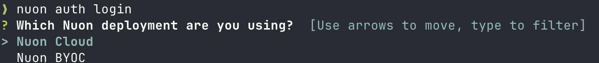
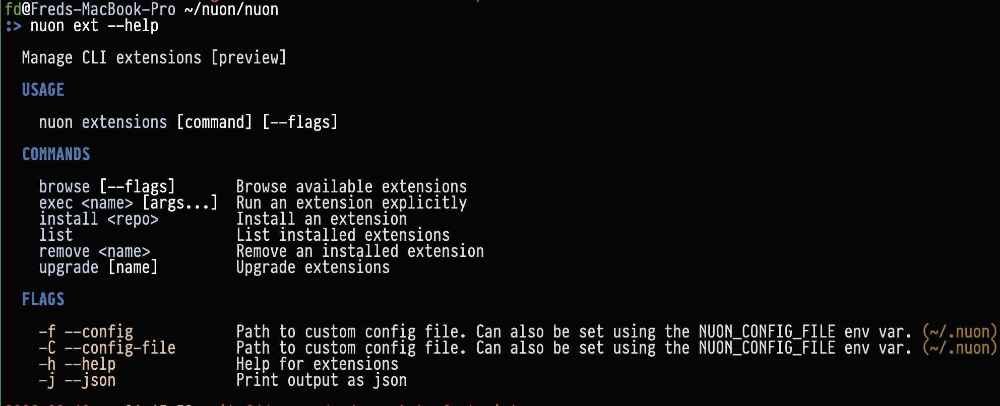

## Installation

### Homebrew

We publish an official tap you can install with [Homebrew](https://brew.sh/).

```sh
brew install nuonco/tap/nuon
```

After installation, you may need to refresh your shell session.

```sh
source ~/.bashrc # or ~/.zshrc, etc.
```

You can also enable autocomplete for you shell. Run `nuon completion` to see what shells we support.

```sh
source <(nuon completion <your-shell>)
```

### Install Script

If you are not using Homebrew, you can use our install script to automatically download and install the correct binary
for your platform (macOS or Linux):

```sh
bash <(curl -sSL https://nuon-artifacts.s3.us-west-2.amazonaws.com/cli/install.sh)
```

The script automatically detects your OS and architecture, downloads the latest version, and installs it to your path.

### Manual Binary Download

You can also download binaries directly for macOS or Linux:

- `darwin_amd64`
- `darwin_arm64`
- `linux_arm`
- `linux_arm64`
- `linux_386`
- `linux_amd64`

Binaries are published to https://nuon-artifacts.s3.us-west-2.amazonaws.com/cli, and versioned by release. To download a
binary, first look up the current API version, and then download the current binary for your platform.

To look up the current API version:

```sh
curl https://api.nuon.co/version
```

To download the binaries for a specific version, substitute the version and platform into the following URL:
`https://nuon-artifacts.s3.us-west-2.amazonaws.com/cli/$VERSION/nuon_${PLATFORM}`

An example of downloading version `0.19.421` of the CLI for `darwin_arm64`:

```sh
wget -O nuon https://nuon-artifacts.s3.us-west-2.amazonaws.com/cli/0.19.421/nuon_darwin_arm64
```

Once the binary has been downloaded remember to make it executable.

```sh
chmod +x nuon
```

### Updates

<Note>The Nuon CLI changes frequently, so we recommend you update it regularly.</Note>

You can update the CLI using Homebrew:

```sh
brew update
brew upgrade nuonco/tap/nuon
```

Or, if you installed via the install script, simply run it again to get the latest version. For manual binary installs,
download the latest version from the S3 bucket as described above.

### Debug Mode

In the case that something goes wrong, you can set the environment variable `NUON_DEBUG` to print verbose logs. These
can be helpful to share with us, while debugging any issues.

```sh
NUON_DEBUG=true nuon apps list
```

### Using the CLI against a BYOC Instance

If you are using a Nuon BYOC instance, i.e., a self-hosted Nuon control plane running in your own infrastructure, you
can use the CLI to interact with it.

To do this, you can:

```sh
NUON_API_URL=https://api.your-byoc-instance.com nuon auth login

# or

export NUON_API_URL=https://api.your-byoc-instance.com
nuon auth login #or other nuon CLI commands.
```

By default, the CLI will use api.nuon.co as the API URL.

`nuon auth login` also prompts the user to either use Nuon Cloud (api.nuon.co) or BYOC Nuon where the user can enter
their Nuon control place URL



## Nuon Preview Features

We are working on a number of TUIs for the CLI. These include contextual TUIs for object selection and full-page TUIs
for workflows and actions. These features can be enabled by setting `NUON_PREVIEW=true`.


At the time of writing, we have experimental TUIs for actions, workflows, and for creating new installs.

### Nuon CLI Extensions

The `nuon` cli has support for extensions. You can browse nuon-authored extensions with `nuon ext browse` and author
your own. At the time of writing, we have published a handful of extensions for public consumption. Try our api
extension with `nuon install api`.


