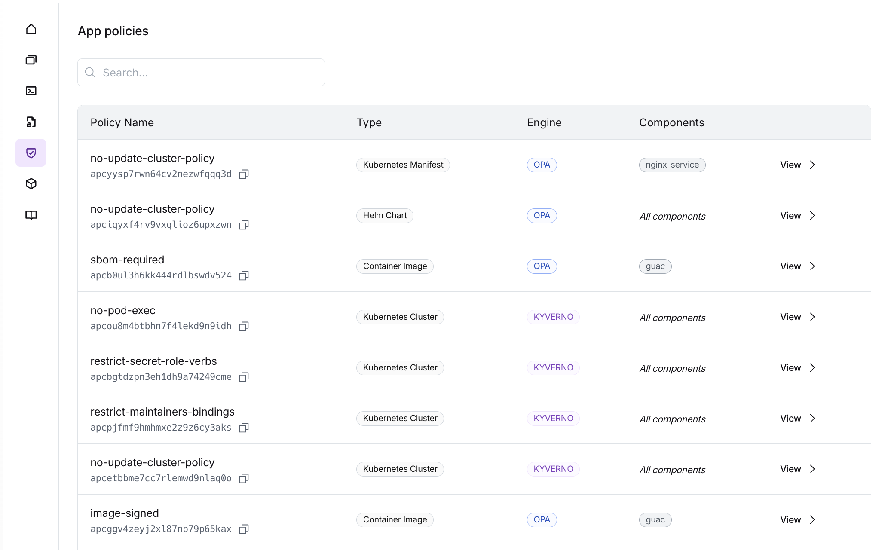
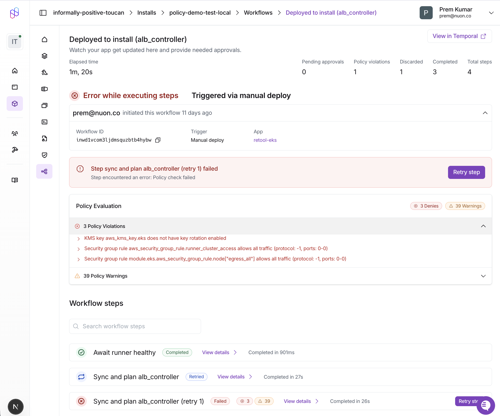
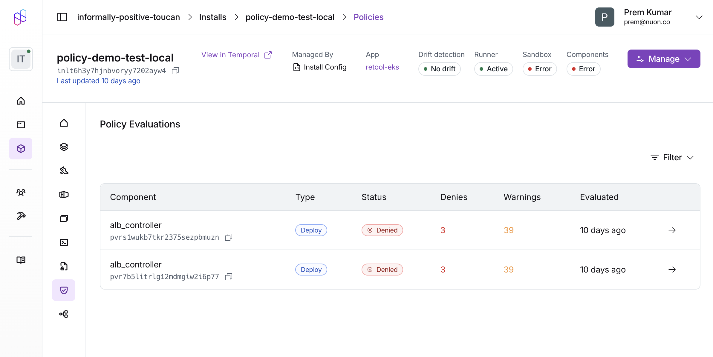

Policies allow you to enforce compliance, security, and operational standards across your infrastructure deployments. Policies are evaluated during builds and deploys, blocking or warning when violations are detected.

## What are Policies?

Policies are rules written in [OPA Rego](https://www.openpolicyagent.org/docs/latest/policy-language/) or [Kyverno](https://kyverno.io/) that validate your infrastructure before deployment. Each policy can either:

- **Deny** - Block the build or deployment when a violation is detected
- **Warn** - Log a warning but allow the build or deployment to continue

Policies are evaluated at different phases depending on the component type:

- **Build-time**: Policies run during the component build process
- **Deploy-time**: Policies run after the plan is generated, before applying changes
- **Sandbox runs**: Policies run during sandbox infrastructure provisioning

## Policy Types

Nuon supports policies for different component types, each with its own input format:

| Type | Applies To | Engine | Evaluation Phase | Input Format |
|------|------------|--------|------------------|--------------|
| `container_image` | External container images | OPA | Build | Image metadata (SBOM, signatures, attestations) |
| `helm_chart` | Helm chart components | OPA | Deploy | Kubernetes AdmissionReview |
| `kubernetes_manifest` | Kubernetes manifest components | OPA | Deploy | Kubernetes AdmissionReview |
| `terraform_module` | Terraform module components | OPA | Deploy | Terraform JSON plan |
| `kubernetes_cluster` | Kubernetes cluster resources | Kyverno | Deploy | Kubernetes resources |
| `sandbox` | Sandbox infrastructure | OPA | Sandbox run | Terraform JSON plan |

## Policy Engines

### OPA (Open Policy Agent)

OPA policies are written in [Rego](https://www.openpolicyagent.org/docs/latest/policy-language/), a declarative query language. Policies must be in the `nuon` package and use `deny` or `warn` rules.

The input structure varies by policy type:

| Policy Type | Input Structure |
|-------------|-----------------|
| `terraform_module`, `sandbox` | `input.plan.resource_changes`, `input.plan.terraform_version` |
| `helm_chart`, `kubernetes_manifest` | `input.review.object`, `input.review.kind` |
| `container_image` | `input.image`, `input.tag`, `input.metadata` |

**Example: Terraform policy**

```rego
package nuon

# Deny unencrypted S3 buckets
deny contains msg if {
    some resource in input.plan.resource_changes
    resource.type == "aws_s3_bucket"
    resource.change.actions[_] in ["create", "update"]
    not resource.change.after.server_side_encryption_configuration
    msg := sprintf("S3 bucket '%s' must have encryption enabled", [resource.address])
}

# Warn about missing tags
warn contains msg if {
    some resource in input.plan.resource_changes
    resource.change.actions[_] in ["create", "update"]
    not resource.change.after.tags.Environment
    msg := sprintf("Resource '%s' is missing Environment tag", [resource.address])
}
```

**Example: Kubernetes/Helm policy**

```rego
package nuon

# Deny containers running as root
deny contains msg if {
    input.review.kind.kind == "Pod"
    some container in input.review.object.spec.containers
    container.securityContext.runAsUser == 0
    msg := sprintf("Container '%s' must not run as root", [container.name])
}
```

**Example: Container image policy**

```rego
package nuon

# Deny unsigned images
deny contains msg if {
    not input.metadata.signed
    msg := sprintf("Image %s:%s must be signed", [input.image, input.tag])
}
```

### Kyverno

Kyverno policies use YAML syntax and are designed for Kubernetes resources. Kyverno is only supported for `kubernetes_cluster` policy types:

```yaml
apiVersion: kyverno.io/v1
kind: ClusterPolicy
metadata:
  name: require-labels
spec:
  validationFailureAction: Enforce
  rules:
    - name: check-team-label
      match:
        any:
          - resources:
              kinds:
                - Pod
      validate:
        message: "All pods must have a 'team' label"
        pattern:
          metadata:
            labels:
              team: "?*"
```

## How do you configure Policies?

Policies are part of your app configuration. To create or update policies, add them to your app config and sync:

```sh
nuon apps sync
```



Please go through the [Configuring Policies guide](/guides/configuring-policies) for details.

Note that unlike components, policies do not need to be built, they are evaluated directly during build and deploy workflows.

## Policy Reports

### Build-Time Evaluation

Build-time policies are evaluated during the component build process:

- **`container_image`**: Policies evaluate image metadata (SBOM, signatures, attestations) fetched from the registry

If a `deny` rule matches during build-time evaluation, the build fails with status `policy_failed`.

### Deploy-Time Evaluation

Deploy-time policies are evaluated after the plan is generated, before applying changes:

- **`terraform_module`**: Policies evaluate the Terraform JSON plan
- **`helm_chart`**: Policies evaluate the Kubernetes AdmissionReview objects
- **`kubernetes_manifest`**: Policies evaluate the Kubernetes AdmissionReview objects

If a `deny` rule matches during deploy-time evaluation, the workflow step fails and changes are not applied.


### Sandbox Evaluation

Sandbox policies (`type = "sandbox"`) are evaluated during sandbox infrastructure runs. They receive the Terraform JSON plan for the sandbox infrastructure.

## Viewing Policy Results

### Dashboard

Policy violations are displayed in the workflow step details. The Policy Report card shows:

- **Passed**: All policy checks passed successfully
- **Denies**: Policy violations that blocked the workflow (red)
- **Warnings**: Policy warnings that were logged but didn't block (orange)

Each violation includes the policy name and the specific message from your `deny` or `warn` rule.



You can also view a list of all policy reports for an install, or filter by their status, type etc.




### CLI

Build failures due to policy violations show the `policy_failed` status:

```sh
nuon builds create -c my-component

# Output:
# ✗ component build failed policy check: Image nginx:latest must be signed
```

Workflow steps display policy violation counts in the output:

```sh
nuon installs workflows steps list -w <workflow-id>

# Output shows policy column with ✗ (denies) and ⚠ (warnings):
# Step          Status    Policy
# deploy-api    error     ✗ 2
# deploy-db     success   ✓
# deploy-cache  success   ⚠ 1
```

Get detailed violation messages for a specific step:

```sh
nuon installs workflows steps get -w <workflow-id> -s <step-id>
```

## Policy Examples

<Note>
  We maintain a [collection of example policies](https://github.com/nuonco/policies) 
  organized by component type to help you get started.
</Note>

The example repository includes:

- **`terraform/`** - Policies for Terraform modules (encryption, tagging, IAM security, cost controls)
- **`kubernetes/`** - Policies for Helm charts and Kubernetes manifests (pod security, resource limits, networking)

## Related Resources

- [External Image Policies Guide](/guides/external-image-policies) - Detailed reference for container image metadata and Rego patterns
- [Policies Configuration Reference](/config-ref/policies) - Schema reference for policy configuration
- [Example Policies Repository](https://github.com/nuonco/policies) - Ready-to-use policy examples
