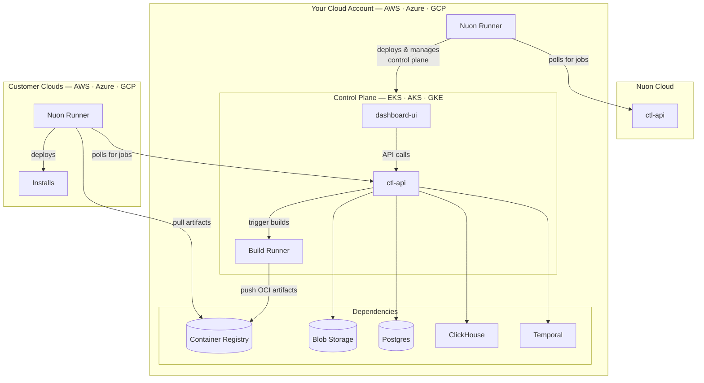

Nuon BYOC gives you a single-tenant Nuon control plane running in your own AWS, Azure, or Google Cloud account. Nuon uses its own platform to remotely deploy and manage the control plane as an install — the same mechanism you use to deploy software to your customers. You get automatic upgrades, operational visibility, and lifecycle management while retaining full ownership of your data, networking, and compliance posture.

This deployment option is often referred to as Bring Your Own Cloud (BYOC), Cloud-Prem, or Vendor-Managed Self-Hosted.

Nuon BYOC requires a paid license. [Contact sales](https://nuon.co/contact-sales) to get started.

## Architecture

Nuon Cloud manages your BYOC control plane as an install — the same way your control plane will manage installs for your own customers. Upgrades, provisioning, and lifecycle operations are all driven remotely by Nuon.

## Supported Platforms

- [AWS](/guides/byoc/aws) — Nuon deploys on EKS with RDS, ECR, Route 53, ACM, and Secrets Manager.
- [Azure](/guides/byoc/azure) — AKS with Azure SQL, ACR, Blob Storage, and Key Vault.
- [GCP](/guides/byoc/gcp) — GKE with Cloud SQL, GAR, GCS, and Secret Manager.
