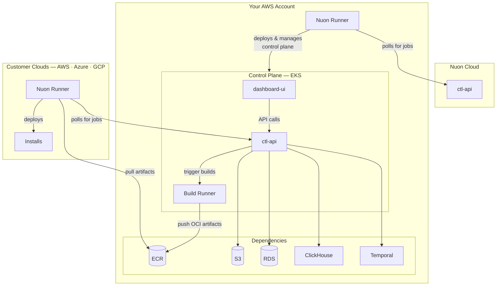

<Note>
Nuon can install Nuon on your cloud. [Please reach out to sales.](https://nuon.co/demo-request)
</Note>

## Architecture

Nuon Cloud manages your BYOC control plane as an install — the same way your control plane will manage installs for your own customers. Upgrades, provisioning, and lifecycle operations are all driven remotely by Nuon.



## AWS Account

You will need an AWS account. A VPC and other network infrastructure will be created during the installation. Ensure
your user has admin permissions, and that the account has not reached it's quota limits for VPCs, EIPs, and Internet
Gateways.

The following regions have been tested and confirmed to support Nuon BYOC.

- us-east-1
- eu-west-1

<Note>Nuon's resource requirements are not compatible with AWS Free Tier. You will need a paid account.</Note>
## Inputs

After configuring all dependencies, update your install inputs in the customer dashboard.

### Authentication Configuration

| Input              | Value                                  |
| ------------------ | -------------------------------------- |
| Auth Provider Type | `google` or `oidc`                     |
| Auth Client ID     | `[secret]`                             |
| Auth Client Secret | `[secret]`                             |
| Auth Redirect URL  | `https://auth.<your-root-domain>/auth` |

<Warning>
If using the deprecated Auth0 integration, you will need to provide these inputs instead.

| Input | Value |
|-------|-------|
| Auth0 Issuer URL | Your Auth0 tenant URL |
| Auth0 Audience | Your Auth0 API identifier |
| Auth0 Client ID - CTL API | Your Auth0 native app client ID |
| Auth0 Client ID - Dashboard UI | Your Auth0 SPA client ID |
</Warning>

### GitHub Configuration

| Input                | Value                          |
| -------------------- | ------------------------------ |
| Github App Name      | Name of your GitHub app        |
| Github App ID        | ID of your GitHub app          |
| Github App Client ID | Client ID from your GitHub app |

### DNS Configuration

| Input       | Value                                                                        |
| ----------- | ---------------------------------------------------------------------------- |
| Root Domain | Your custom domain, or `<your-install-id>.nuon.run` for Nuon-provided domain |

### Database Configuration (Optional)

Adjust instance sizes for RDS, Temporal, and ClickHouse clusters if needed.

### Slack Configuration (Optional)

Provide these only if you created a Slack app in the [Slack App](#slack-app-optional) section. Leave blank to disable the Slack integration.

| Input                     | Value                                                     |
| ------------------------- | --------------------------------------------------------- |
| Slack Client ID           | Client ID from your Slack app's Basic Information page    |
| Slack OAuth Redirect URL  | `https://slack.<your-root-domain>/slack/oauth/callback`   |

## Secrets

When provisioning the CloudFormation stack, provide these secrets:

| Secret               | Value                                  |
| -------------------- | -------------------------------------- |
| `github_app_key`     | Your base64-encoded GitHub App PEM key |
| `auth_client_secret` | The client secret from your Auth0 SPA  |
| `slack_client_secret` | Client Secret from your Slack app (optional — required only if using Slack) |
| `slack_signing_secret` | Signing Secret from your Slack app (optional — required only if using Slack) |
| `slack_state_jwt_secret` | A random high-entropy string (e.g. `openssl rand -hex 32`); signs the OAuth state JWT during Slack installation. Optional — required only if using Slack. |

<Note>
The GitHub App PEM key must be base64 encoded because AWS CloudFormation doesn't preserve newlines in text fields.

To encode your PEM key:

```bash
base64 -i your-github-app-key.pem
```

</Note>

## Provision

Once all inputs and secrets are configured

1. Return to your install in the Nuon dashboard
2. Click **Reprovision Install** from the Manage menu
3. Wait for the provision workflow to complete

## Configure DNS (Optional)

To host your BYOC Nuon instance under a custom domain, configure DNS for your root domain to point to the Route53 Zone
created in the sandbox.

After the sandbox provisions, you'll receive:

- A **Zone ID** for your public domain
- **Nameserver records** to add to your domain's DNS

Create NS records in your domain's DNS pointing to the Route53 nameservers provided.

<Tip>
  See [Creating a subdomain that uses Amazon Route 53 as the DNS
  service](https://docs.aws.amazon.com/Route53/latest/DeveloperGuide/CreatingNewSubdomain.html) for detailed
  instructions.
</Tip>

## Verify Installation

After successful provisioning, verify your installation is working by visiting these URLs.

| Service    | URL                                 |
| ---------- | ----------------------------------- |
| Dashboard  | `https://app.<your-root-domain>`    |
| CTL API    | `https://api.<your-root-domain>`    |
| Runner API | `https://runner.<your-root-domain>` |

You can also verify the API is responding by curling it directly.

```bash
curl https://api.<your-root-domain>/health
```
