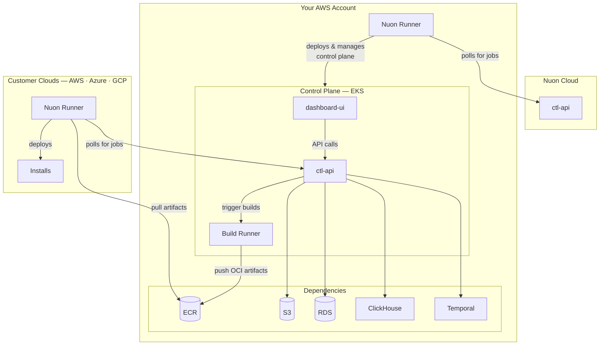

<Note>
Nuon can install Nuon on your cloud. [Please reach out to sales.](https://nuon.co/demo-request)
</Note>

## Architecture

Nuon Cloud manages your BYOC control plane as an install — the same way your control plane will manage installs for your own customers. Upgrades, provisioning, and lifecycle operations are all driven remotely by Nuon.



## Requirements

### AWS Account

You will need an AWS account. A VPC and other network infrastructure will be created during the installation. Ensure
your user has admin permissions, and that the account has not reached it's quota limits for VPCs, EIPs, and Internet
Gateways.

The following regions have been tested and confirmed to support Nuon BYOC.

- us-east-1
- eu-west-1

<Note>Nuon's resource requirements are not compatible with AWS Free Tier. You will need a paid account.</Note>

### DNS

#### Root DNS

You will need to expose the Nuon APIs and Dashboard to be able to use it, which requires setting up DNS. For example, if you wanted to host Nuon BYOC at `nuon.my-domain.com`, complete the following steps.

1. Before installation, create the DNS zone `my-domain.com` if it does not already exist.
1. Provide `nuon.my-domain.com` as the value for the Root Domain input.
1. Once Nuon BYOC has fully provisioned, the domains of the DNS servers for the install will be available in the outputs.
1. Create an NS record named `nuon.my-domain.com`, using the DNS server domains as the value.
1. Once propagation is complete, the Nuon Dashboard should be reachable at `app.nuon.my-domain.com`.

Nuon will provision the following subdomains under the domain you configure. Only the runner API needs to be exposed to the Internet. The rest of the subdomains can all be private to your network.

| Subdomain | Service | Public |
| --------- | ------- | ------ |
| app       | The vendor dashboard | |
| api       | The control plane API, used by the Vendor Dashboard and the CLI | |
| admin     | The admin API. Exposes functionality for administration of the control plane | |
| runner    | The API used by runners to communicate with the control plane. | true |
| slack     | The Slack integration listener (OAuth callback, slash commands, events, interactions). Provisioned on every install — active once Slack credentials are configured. | true |

<Warning>
The Nuon Dashboard uses cookies for authentication, and they will be shared on all subdomains of the provided root domain. We strongly recommend creating a Nuon-specific subdomain to avoid leaking auth cookies.
</Warning>

#### Delegation DNS

If you do not want your users to have to have to set up DNS when installing your app, you can optionally configure your apps to use DNS delegation. A unique subdomain will be created for each install under a shared subdomain. In Nuon Cloud, for example, we use `nuon.run`. Installs created in Cloud will can given a subdomain based on their install ID, such as `inl160z2xmng8w1jnq0xxhelln.nuon.run`.

You don't need to use this feature, but the control plane does require you to configure a domain it can use in the event that you do.

### GitHub App

Create a GitHub App so Nuon can clone code for components from private repos.

1. Go to [GitHub App Settings](https://github.com/settings/apps) and click **New GitHub App**

2. Configure the app with these settings:

| Setting            | Value                                    |
| ------------------ | ---------------------------------------- |
| GitHub App name    | Choose any name (e.g., "Nuon BYOC")      |
| Homepage URL       | `https://app.<your-root-domain>`         |
| Setup URL          | `https://app.<your-root-domain>/connect` |
| Redirect on Update | Checked                                  |
| Webhook            | Unchecked                                |

3. Set permissions:

| Permission | Access    |
| ---------- | --------- |
| Contents   | Read-only |

4. Under "Where can this GitHub App be installed?", select **Only on this account** (unless you need to access repos in
   other GitHub organizations)

5. Click **Create GitHub App**

6. After creation, scroll to the bottom and click **Generate a private key**. Save this PEM file - you'll need it later.

7. Note your **App ID** and **Client ID** from the app settings page.

### Identity Provider

Nuon must be configured to use your IdP for authentication.

#### Google

To use Google as your IdP, set up a client in Google Auth Platform. You will need a Google Cloud Platform account.

1. Log into your Google Cloud Platform console.
1. Navigate to Google Auth Platform, and open the "Clients" tab.
1. Create a new client named "Nuon BYOC".
1. Save the client ID and secret.
1. Add an authorized redirect URI with the value, `https://auth.<your-root-domain>/auth`.


#### Okta

To use Okta as your IdP, set up an OIDC Application in Okta.

1. In the Okta Admin Console, navigate to Applications and create a new OIDC application.
    1. For Sign-in method: Select OIDC - OpenID Connect
    1. For Application type: Select Web Application
1. Set the **Sign In Redirect** to `https://auth.<your-root-domain>/auth`
1. Set **Trusted Origins** to `<your-root-domain>`
1. Save the client id and secret.


#### Auth0 (DEPRECATED)

<Warning>
Nuon BYOC previously required Auth0 for authentication, but this dependency has been removed. This documentation is retained for anyone still using Auth0, but new Nuon BYOC installs should use the new IdP integration documented above.
</Warning>

To use Auth0 for authentication, you will need to configure an API, applications, and a custom action in your Auth0 tenant.

Nuon provides a Terraform module to automate Auth0 configuration. We recommend this over manual configuration. Apply the following Terraform to use it.

```hcl
module "byoc_auth0" {
  source = "github.com/nuonco/byoc-auth0"
  # Your Auth0 tenant domain
  auth0_domain = "your-tenant.auth0.com"
  # The root domain for your BYOC install
  public_domain = "<your-root-domain>"
  # Your Nuon install ID
  install_id   = "<your-install-id>"
  install_name = "<your-install-name>"
}
```

After applying, the module outputs the values you will need for the install inputs.

If you prefer to configure Auth0 manually, follow the steps below.

Add an action to enrich the access token with the user's email.

1. Go to **Actions > Library** in your Auth0 dashboard
2. Click **Create Action > Build from scratch**
3. Name it `AddScope` and select the latest runtime
4. Replace the code with:

```javascript
exports.onExecutePostLogin = async (event, api) => {
  const email = event.user.email;
  api.accessToken.setCustomClaim(`email`, email);
};
```

5. Deploy the action
6. Go to **Actions > Triggers > Post Login**
7. Drag the `AddScope` action into the flow and save

Create an API with the following settings.

| Setting | Value |
|---------|-------|
| Name | `API Gateway <your-install-id>` |
| Identifier | `api.<your-root-domain>` |
| Maximum Access Token Lifetime | `2592000` |
| Implicit/Hybrid Flow Access Token Lifetime | `86400` |
| Allow Skipping User Consent | `true` |

<Note>
The Identifier must match your API URL exactly. It cannot be changed after creation.
</Note>

Create a Single Page Application for the Dashboard UI.

| Setting | Value |
|---------|-------|
| Name | `Nuon App - <your-install-name>` |
| Allowed Callback URLs | `https://app.<your-root-domain>/api/auth/callback` |
| Allowed Logout URLs | `https://app.<your-root-domain>` |
| Allowed Web Origins | `https://app.<your-root-domain>` |
| Allow Cross-Origin Authentication | `true` |
| Maximum Refresh Token Lifetime | `31557600` |
| Allow Refresh Token Rotation | `true` |
| Rotation Overlap Period | `0` |

Create a Native Application for CLI authentication.

| Setting | Value |
|---------|-------|
| Name | `Nuon CTL API - <your-install-name>` |
| Description | `For BYOC Nuon Install <your-install-id>` |
| Allow Cross-Origin Authentication | `true` |
| Device Code (Advanced > Grant Types) | Checked |

### Slack App (Optional)

If you would like Nuon BYOC to send notifications to your Slack workspace, you can configure a Slack app for it to integrate with. This is optional. You can skip this, or enable it later.

<Note>
Since the Slack app requires secrets, enabling it later will require reprovisioning the install, so you can provide these secrets to the Stack.
</Note>

Create the Slack app from the manifest below — it pre-configures scopes, the `/nuon` slash command, interactivity, and event subscriptions. You can edit any of these later from the Slack app's settings.

1. Copy the manifest below into a scratch buffer and replace **both** occurrences of `<your-root-domain>` with your actual root domain (e.g. `nuon.my-domain.com`). The host is the `slack.` subdomain in front of your install.

   ```yaml
   display_information:
     name: Nuon
     description: Nuon BYOC deployment notifications in Slack.
     background_color: "#0b0b0f"
     long_description: |
       Nuon posts deployment lifecycle events from your installs, sandboxes,
       runners, and actions into the Slack channels you choose. Subscribe per
       org, filter by interest (failures, components, sandboxes, runners,
       actions).

   features:
     bot_user:
       display_name: Nuon
       always_online: true
     slash_commands:
       - command: /nuon
         url: https://slack.<your-root-domain>/slack/commands/nuon
         description: Manage Nuon notifications in Slack
         usage_hint: subscribe [install] | unsubscribe | status | help
         should_escape: false

   oauth_config:
     redirect_urls:
       - https://slack.<your-root-domain>/slack/oauth/callback
     scopes:
       bot:
         - chat:write
         - chat:write.public
         - channels:read
         - groups:read
         - team:read
         - commands
     pkce_enabled: false

   settings:
     org_deploy_enabled: false
     socket_mode_enabled: false
     token_rotation_enabled: false
     is_mcp_enabled: false
     interactivity:
       is_enabled: true
       request_url: https://slack.<your-root-domain>/slack/interactions
       message_menu_options_url: https://slack.<your-root-domain>/slack/interactions
     event_subscriptions:
       request_url: https://slack.<your-root-domain>/slack/events
       bot_events:
         - app_uninstalled
         - tokens_revoked
         - channel_rename
         - channel_archive
         - channel_left
   ```

2. Go to [Slack API: Your Apps](https://api.slack.com/apps) and click **Create New App → From a manifest**. Select your own Slack workspace as the development workspace — this is where you'll manage the app's settings going forward. Customers will install the app into their own workspaces later via OAuth. Paste the manifest and create the app.

3. Under **Basic Information**, copy your **Client ID**, **Client Secret**, and **Signing Secret** — you'll provide these to Nuon as inputs and secrets.
## Inputs

After configuring all dependencies, update your install inputs in the customer dashboard.

### Authentication Configuration

| Input              | Value                                  |
| ------------------ | -------------------------------------- |
| Auth Provider Type | `google` or `oidc`                     |
| Auth Client ID     | `[secret]`                             |
| Auth Client Secret | `[secret]`                             |
| Auth Redirect URL  | `https://auth.<your-root-domain>/auth` |

<Warning>
If using the deprecated Auth0 integration, you will need to provide these inputs instead.

| Input | Value |
|-------|-------|
| Auth0 Issuer URL | Your Auth0 tenant URL |
| Auth0 Audience | Your Auth0 API identifier |
| Auth0 Client ID - CTL API | Your Auth0 native app client ID |
| Auth0 Client ID - Dashboard UI | Your Auth0 SPA client ID |
</Warning>

### GitHub Configuration

| Input                | Value                          |
| -------------------- | ------------------------------ |
| Github App Name      | Name of your GitHub app        |
| Github App ID        | ID of your GitHub app          |
| Github App Client ID | Client ID from your GitHub app |

### DNS Configuration

| Input       | Value                                                                        |
| ----------- | ---------------------------------------------------------------------------- |
| Root Domain | Your custom domain, or `<your-install-id>.nuon.run` for Nuon-provided domain |

### Database Configuration (Optional)

Adjust instance sizes for RDS, Temporal, and ClickHouse clusters if needed.

### Slack Configuration (Optional)

Provide these only if you created a Slack app in the [Slack App](#slack-app-optional) section. Leave blank to disable the Slack integration.

| Input                     | Value                                                     |
| ------------------------- | --------------------------------------------------------- |
| Slack Client ID           | Client ID from your Slack app's Basic Information page    |
| Slack OAuth Redirect URL  | `https://slack.<your-root-domain>/slack/oauth/callback`   |

## Secrets

When provisioning the CloudFormation stack, provide these secrets:

| Secret               | Value                                  |
| -------------------- | -------------------------------------- |
| `github_app_key`     | Your base64-encoded GitHub App PEM key |
| `auth_client_secret` | The client secret from your Auth0 SPA  |
| `slack_client_secret` | Client Secret from your Slack app (optional — required only if using Slack) |
| `slack_signing_secret` | Signing Secret from your Slack app (optional — required only if using Slack) |
| `slack_state_jwt_secret` | A random high-entropy string (e.g. `openssl rand -hex 32`); signs the OAuth state JWT during Slack installation. Optional — required only if using Slack. |

<Note>
The GitHub App PEM key must be base64 encoded because AWS CloudFormation doesn't preserve newlines in text fields.

To encode your PEM key:

```bash
base64 -i your-github-app-key.pem
```

</Note>

## Provision

Once all inputs and secrets are configured

1. Return to your install in the Nuon dashboard
2. Click **Reprovision Install** from the Manage menu
3. Wait for the provision workflow to complete

## Configure DNS (Optional)

To host your BYOC Nuon instance under a custom domain, configure DNS for your root domain to point to the Route53 Zone
created in the sandbox.

After the sandbox provisions, you'll receive:

- A **Zone ID** for your public domain
- **Nameserver records** to add to your domain's DNS

Create NS records in your domain's DNS pointing to the Route53 nameservers provided.

<Tip>
  See [Creating a subdomain that uses Amazon Route 53 as the DNS
  service](https://docs.aws.amazon.com/Route53/latest/DeveloperGuide/CreatingNewSubdomain.html) for detailed
  instructions.
</Tip>

## Verify Installation

After successful provisioning, verify your installation is working by visiting these URLs.

| Service    | URL                                 |
| ---------- | ----------------------------------- |
| Dashboard  | `https://app.<your-root-domain>`    |
| CTL API    | `https://api.<your-root-domain>`    |
| Runner API | `https://runner.<your-root-domain>` |

You can also verify the API is responding by curling it directly.

```bash
curl https://api.<your-root-domain>/health
```
