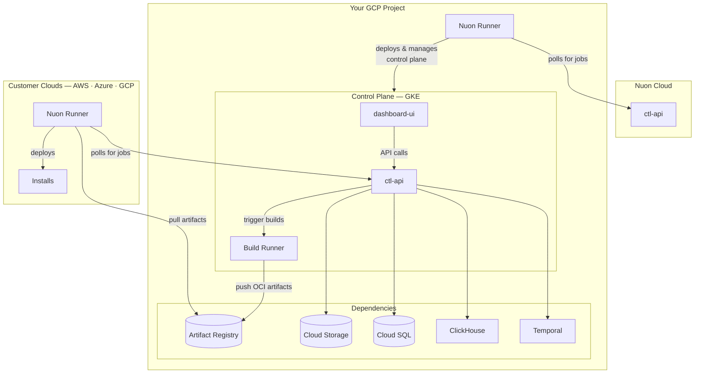

<Note>Nuon can install Nuon on your cloud. [Please reach out to sales.](https://nuon.co/demo-request)</Note>

## Architecture

Nuon Cloud manages your BYOC control plane as an install — the same way your control plane will manage installs for your
own customers. Upgrades, provisioning, and lifecycle operations are all driven remotely by Nuon.



Cloud SQL backs both the Nuon control-plane database and Temporal's database; the two run as separate Cloud SQL
instances and are sized independently through the inputs.

## DNS Configuration

Before proceeding with the installation creation, Nuon will need the following values. These are used to configure DNS
for the services and the [DNS Delegation](https://docs.nuon.co/guides/byoc/requirements#delegation-dns) feature.

| Input                                             | Value                                                                                                          |
| ------------------------------------------------- | -------------------------------------------------------------------------------------------------------------- |
| Root Domain (`root_domain`)                       | The root domain from which Nuon services are served (e.g. `nuon.my-domain.com`, `msh.my-domain.com`).          |
| Install DNS Delegation Domain (`nuon_dns_domain`) | Domain used to provision Cloud DNS zones for installs (e.g. `installs.my-domain.com`, `hosted.my-domain.com`). |

Nuon sets these values on install creation so they are required up front.

## GCP Project

You'll need a GCP project with a few APIs enabled. The install stack provisions a VPC and other network primitives, so
make sure your account has IAM permissions to create those resources and the project has not hit quota limits for VPCs,
Cloud SQL instances, or GKE clusters.

The following APIs are required by the `install-stack` and BYOC Nuon. These will be enabled by the `install-stack`
terraform module.

- Secrets Manager API
- Compute Engine API
- IAM Service Account Credentials API
- Cloud Resource Manager API
- Kubernetes Engine API
- Cloud DNS API
- Artifact Registry API
- Certificate Manager API
- Service Networking API
- Cloud SQL Admin API

## AWS Account

An AWS Account is required solely for the purpose of hosting a single S3 bucket which holds install templates for use by
CloudFormation stacks for BYOC Installs targetting AWS. We can, and will initially, provide this bucket but you can
bring your own at any time.

## Provision the Install Stack

BYOC Nuon on GCP is provisioned with terraform using the the
[`nuonco/install-stacks`](https://github.com/nuonco/install-stacks) module. Nuon will share an `install.tfvars` file
with the values specific to your install which you will augment with configuration and input values you control. Once
the vars file is populated and the module is in your CI pipeline, you will apply the install stack the
[`nuonco/install-stacks`](https://github.com/nuonco/install-stacks) module to provision the following resources for BYOC
Nuon:

- VPC
- GKE cluster
- Cloud
- SQL instances
- Cloud Storage buckets
- Artifact Registry
- IAM service accounts
- Secret Manager

### 1. Clone the install stack module

```bash
git clone https://github.com/nuonco/install-stacks.git
cd install-stacks/gcp
```

### 2. Configure remote state (recommended)

Create a `backend.tf` file to store Terraform state in GCS.

```terraform backend.tf
terraform {
  backend "gcs" {
    bucket = "<your-state-bucket>"
    prefix = "nuon/<your-install-id>"
  }
}
```

### 3. Populate and save the install configuration

Save the install config Nuon shared with you as `install.tfvars`. The values fall into two categories.

**Provided by Nuon** — these come from your install record and Nuon will share them with you:

| Variable                 | Description                                                   |
| ------------------------ | ------------------------------------------------------------- |
| `nuon_install_id`        | Your Nuon install ID.                                         |
| `nuon_org_id`            | Your Nuon org ID.                                             |
| `nuon_app_id`            | The Nuon app ID for the BYOC Nuon control plane.              |
| `runner_api_url`         | The Nuon Runner API URL (typically `https://runner.nuon.co`). |
| `runner_api_token`       | The auth token your Nuon Runner uses to poll Nuon Cloud.      |
| `runner_id`              | The Nuon Runner ID assigned to this install.                  |
| `runner_init_script_url` | URL to the runner bootstrap script.                           |
| `phone_home_url`         | The phone-home URL for the Runner heartbeat.                  |

**Configured by you** — these define what the runner is allowed to do in your project:

| Variable                      | Description                                                                                             |
| ----------------------------- | ------------------------------------------------------------------------------------------------------- |
| `provision_predefined_role`   | Pre-defined GCP role used as the base during provision (default `roles/owner`).                         |
| `maintenance_predefined_role` | Pre-defined GCP role used during ongoing maintenance (default `roles/owner`).                           |
| `deprovision_predefined_role` | Pre-defined GCP role used during deprovision, automatically disabled after use (default `roles/owner`). |
| `provision_permissions`       | Additional IAM permissions granted to the runner during provision.                                      |
| `maintenance_permissions`     | Additional IAM permissions granted during ongoing maintenance.                                          |
| `deprovision_permissions`     | Additional IAM permissions granted during deprovision.                                                  |
| `break_glass_roles`           | Map of emergency-access roles for incident response. Empty by default.                                  |
| `custom_roles`                | Map of custom IAM roles to create in your project.                                                      |
| `install_inputs`              | Map of install inputs. See documentation below.                                                         |
| `secrets`                     | Map of secret values which will populate entries in Secret Manager. See documentation below.            |
| `auto_generate_secrets`       | Names of secrets Nuon should auto-generate during provisioning (e.g. `clickhouse_cluster_pw`).          |

#### Install Inputs

The `install_inputs` map must be populated with the following values.

##### GitHub Configuration

| Input                                         | Value                                 |
| --------------------------------------------- | ------------------------------------- |
| GitHub App Name (`github_app_name`)           | Name of your GitHub App.              |
| GitHub App ID (`github_app_id`)               | App ID from the app settings page.    |
| GitHub App Client ID (`github_app_client_id`) | Client ID from the app settings page. |

Documentation for the GitHub App can be found [here](https://docs.nuon.co/guides/byoc/requirements#github-app).

##### OIDC Authentication

| Input                                          | Value                                                                                             |
| ---------------------------------------------- | ------------------------------------------------------------------------------------------------- |
| Auth Provider Type (`nuon_auth_provider_type`) | `google`                                                                                          |
| Auth Client ID (`nuon_auth_client_id`)         | Client ID from your Google OAuth credentials.                                                     |
| Auth Issuer URL (`nuon_auth_issuer_url`)       | `https://accounts.google.com`                                                                     |
| Auth Redirect URL (`nuon_auth_redirect_url`)   | `https://auth.<your-root-domain>/auth`                                                            |
| Allowed Domains (`nuon_auth_allowed_domains`)  | Comma-delimited list of email domains allowed to sign in (e.g. `mycompany.com`).                  |
| Allow All Users (`nuon_auth_allow_all_users`)  | `true` to allow anyone matching `Allowed Domains`; `false` to require explicit user provisioning. |

Documentation for Nuon Auth can be found [here](https://docs.nuon.co/guides/byoc/requirements#identity-providers).

##### Slack Configuration (Optional)

Provide these only if you created a Slack app in the [Slack App](#slack-app-optional) section. Leave blank to disable
the Slack integration.

| Input                                                 | Value                                                   |
| ----------------------------------------------------- | ------------------------------------------------------- |
| Slack Client ID (`slack_client_id`)                   | Client ID from your Slack app's Basic Information page. |
| Slack OAuth Redirect URL (`slack_oauth_redirect_url`) | `https://slack.<your-root-domain>/slack/oauth/callback` |

#### Secrets

The `secrets` map must be popoulated with the following:

| Secret                    | Value                                                                         |
| ------------------------- | ----------------------------------------------------------------------------- |
| `github_app_key`          | Your base64-encoded GitHub App PEM key                                        |
| `nuon_auth_client_secret` | OIDC Client Secret from your identity provider.                               |
| `slack_client_secret`     | Client Secret from your Slack app (optional — required only if using Slack).  |
| `slack_signing_secret`    | Signing Secret from your Slack app (optional — required only if using Slack). |

<Note>
The GitHub App PEM key must be base64 encoded because AWS CloudFormation doesn't preserve newlines in text fields.

To encode your PEM key:

```bash
base64 -i your-github-app-key.pem
```

### 4. Apply the install stack

After the `install.tfvars` file is populated, you can apply the stack.

```bash
terraform init
terraform apply -var-file=install.tfvars
```

All of the core-infra will be created with your `gcloud` permissions. After this, the Nuon Runner will be deployed in
your project and will poll Nuon Cloud for jobs to deploy the control plane components.

## Configure DNS

Once the `sandbox` is applied, we will share DNS details for you to configure DNS for your root domain to point to the
Cloud DNS zone created in the sandbox.

- A **Zone Name** for your public domain.
- **Nameserver records** to add to your domain's DNS.

Once you create NS records in your registrar, you will be able to visit the services at the `root_domain` you specified.

## Verify Installation

After successful provisioning, verify your installation by visiting these URLs.

| Service    | URL                                 |
| ---------- | ----------------------------------- |
| Dashboard  | `https://app.<your-root-domain>`    |
| CTL API    | `https://api.<your-root-domain>`    |
| Runner API | `https://runner.<your-root-domain>` |

You can also verify the API is responding by curling it directly.

```bash
curl https://api.<your-root-domain>/version
```
