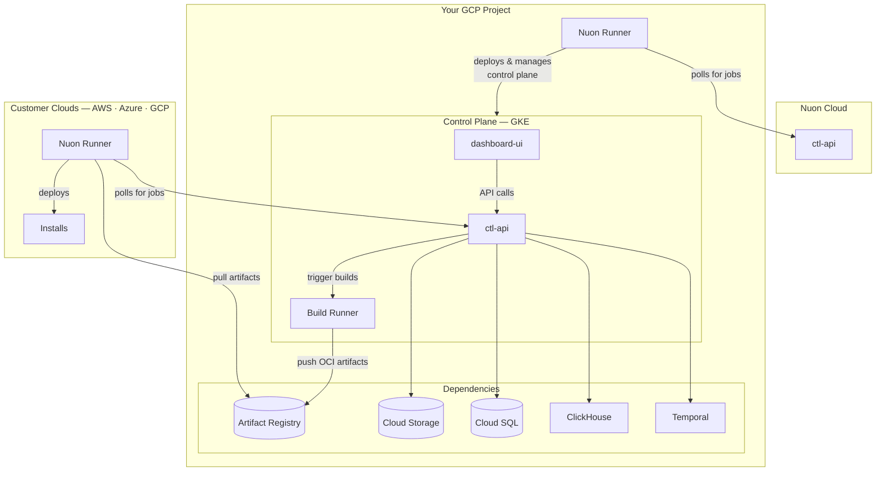

<Note>
Nuon can install Nuon on your cloud. [Please reach out to sales.](https://nuon.co/demo-request)
</Note>

## Architecture

Nuon Cloud manages your BYOC control plane as an install — the same way your control plane will manage installs for your own customers. Upgrades, provisioning, and lifecycle operations are all driven remotely by Nuon.



Cloud SQL backs both the Nuon control-plane database and Temporal's database; the two run as separate Cloud SQL instances and are sized independently through the inputs.

## Requirements

### GCP Project

You'll need a GCP project. The install stack provisions a VPC and other network primitives, so make sure your account has IAM permissions to create those resources and the project has not hit quota limits for VPCs, Cloud SQL instances, or GKE clusters.

### DNS

#### Root DNS

You will need to expose the Nuon APIs and Dashboard, which requires DNS. For example, if you wanted to host Nuon BYOC at `nuon.my-domain.com`, complete the following steps.

1. Before installation, create the DNS zone `my-domain.com` if it does not already exist.
1. Provide `nuon.my-domain.com` as the value for the Root Domain input.
1. Once Nuon BYOC has fully provisioned, the Cloud DNS nameservers for the install will be available in the outputs.
1. Create an NS record named `nuon.my-domain.com` using the Cloud DNS nameserver values.
1. Once propagation is complete, the Nuon Dashboard should be reachable at `app.nuon.my-domain.com`.

Nuon will provision the following subdomains under the domain you configure. Only the runner API needs to be exposed to the Internet. The rest can be private to your network.

| Subdomain | Service | Public |
| --------- | ------- | ------ |
| app       | The vendor dashboard | |
| api       | The control plane API, used by the Vendor Dashboard and the CLI | |
| admin     | The admin API. Exposes functionality for administration of the control plane | |
| runner    | The API used by runners to communicate with the control plane | true |

<Warning>
The Nuon Dashboard uses cookies for authentication, and they will be shared on all subdomains of the provided root domain. We strongly recommend creating a Nuon-specific subdomain to avoid leaking auth cookies.
</Warning>

#### Delegation DNS

If you don't want your customers to set up DNS when installing your app, you can configure DNS delegation: a unique subdomain is provisioned for each install under a shared subdomain you control. In Nuon Cloud, for example, installs land at `inl160z2xmng8w1jnq0xxhelln.nuon.run`.

To brand this subdomain so your customers see your domain instead of `nuon.run` (e.g. `<install-id>.installs.your-domain.com`), see [Custom Domains](/guides/custom-domains).

### GitHub App

Create a GitHub App so Nuon can clone code for components from private repos. You'll share the App ID, Client ID, app name, and PEM key with Nuon — Nuon configures them on your install.

1. Go to [GitHub App Settings](https://github.com/settings/apps) and click **New GitHub App**.

2. Configure the app with these settings:

| Setting            | Value                                    |
| ------------------ | ---------------------------------------- |
| GitHub App name    | Choose any name (e.g., "Nuon BYOC")      |
| Homepage URL       | `https://app.<your-root-domain>`         |
| Setup URL          | `https://app.<your-root-domain>/connect` |
| Redirect on Update | Checked                                  |
| Webhook            | Unchecked                                |

3. Set permissions:

| Permission | Access    |
| ---------- | --------- |
| Contents   | Read-only |

4. Under "Where can this GitHub App be installed?", select **Only on this account** (unless you need to access repos in other GitHub organizations).

5. Click **Create GitHub App**.

6. After creation, scroll to the bottom and click **Generate a private key**. Save the PEM file — you'll provide it as a secret later.

7. Note the **App ID** and **Client ID** from the app settings page — share these along with the app name and PEM file with Nuon.

### Google OAuth

Nuon BYOC on GCP currently supports Google as the OIDC provider.

1. Go to the [Google Cloud Console](https://console.cloud.google.com/) and create or select a project.
2. Navigate to **APIs & Services** > **Credentials**.
3. Click **Create Credentials** > **OAuth client ID** and select **Web application** as the application type.
4. Configure the OAuth client:

| Setting                       | Value                                    |
| ----------------------------- | ---------------------------------------- |
| Name                          | `BYOC Nuon` (or any name)                |
| Authorized JavaScript origins | `https://auth.<your-root-domain>`        |
| Authorized redirect URIs      | `https://auth.<your-root-domain>/auth`   |

5. Save the **Client ID** and **Client Secret** — you'll need them for the install inputs and secrets.

## Provision the Install Stack

Nuon will share an `install.tfvars` file with the values specific to your install. Apply the install stack module from the [`nuonco/install-stacks`](https://github.com/nuonco/install-stacks) repo to provision the VPC, GKE cluster, Cloud SQL instances, Cloud Storage buckets, Artifact Registry, IAM service accounts, and Secret Manager that Nuon BYOC runs on.

### 1. Clone the install stack module

```bash
git clone https://github.com/nuonco/install-stacks.git
cd install-stacks/gcp
```

### 2. Configure remote state (recommended)

Create a `backend.tf` file to store Terraform state in GCS.

```terraform backend.tf
terraform {
  backend "gcs" {
    bucket = "<your-state-bucket>"
    prefix = "nuon/<your-install-id>"
  }
}
```

### 3. Save the install configuration

Save the install config Nuon shared with you as `install.tfvars`. The values fall into two categories.

**Provided by Nuon** — these come from your install record and Nuon will share them with you:

| Variable | Description |
| -------- | ----------- |
| `nuon_install_id` | Your Nuon install ID. |
| `nuon_org_id` | Your Nuon org ID. |
| `nuon_app_id` | The Nuon app ID for the BYOC Nuon control plane. |
| `runner_api_url` | The Nuon Runner API URL (typically `https://runner.nuon.co`). |
| `runner_api_token` | The auth token your Nuon Runner uses to poll Nuon Cloud. |
| `runner_id` | The Nuon Runner ID assigned to this install. |
| `runner_init_script_url` | URL to the runner bootstrap script. |
| `phone_home_url` | The phone-home URL for the Runner heartbeat. |

**Configured by you** — these define what the runner is allowed to do in your project:

| Variable | Description |
| -------- | ----------- |
| `provision_predefined_role` | Pre-defined GCP role used as the base during provision (default `roles/owner`). |
| `maintenance_predefined_role` | Pre-defined GCP role used during ongoing maintenance (default `roles/owner`). |
| `deprovision_predefined_role` | Pre-defined GCP role used during deprovision, automatically disabled after use (default `roles/owner`). |
| `provision_permissions` | Additional IAM permissions granted to the runner during provision. |
| `maintenance_permissions` | Additional IAM permissions granted during ongoing maintenance. |
| `deprovision_permissions` | Additional IAM permissions granted during deprovision. |
| `break_glass_roles` | Map of emergency-access roles for incident response. Empty by default. |
| `custom_roles` | Map of custom IAM roles to create in your project. |
| `install_inputs` | Optional map of install input overrides. Usually left empty here and configured later in the Nuon dashboard. |
| `auto_generate_secrets` | Names of secrets Nuon should auto-generate during provisioning (e.g. `clickhouse_cluster_pw`). |

### 4. Apply the install stack

```bash
terraform init
terraform apply -var-file=install.tfvars
```

The Nuon Runner deployed in your project will then poll Nuon Cloud for jobs to deploy the control plane components.

## Inputs

Once the install stack is applied, share these values with Nuon — Nuon configures them on your install.

### DNS Configuration

| Input | Value |
| ----- | ----- |
| Root Domain (`root_domain`) | The root domain from which Nuon services are served (e.g. `nuon.my-domain.com`). |
| Install DNS Delegation Domain (`nuon_dns_domain`) | Domain used to provision Cloud DNS zones for installs (e.g. `installs.my-domain.com`). |

### GitHub Configuration

| Input | Value |
| ----- | ----- |
| GitHub App Name (`github_app_name`) | Name of your GitHub App. |
| GitHub App ID (`github_app_id`) | App ID from the app settings page. |
| GitHub App Client ID (`github_app_client_id`) | Client ID from the app settings page. |

### OIDC Authentication

| Input | Value |
| ----- | ----- |
| Auth Provider Type (`nuon_auth_provider_type`) | `google` |
| Auth Client ID (`nuon_auth_client_id`) | Client ID from your Google OAuth credentials. |
| Auth Issuer URL (`nuon_auth_issuer_url`) | `https://accounts.google.com` |
| Auth Redirect URL (`nuon_auth_redirect_url`) | `https://auth.<your-root-domain>/auth` |
| Allowed Domains (`nuon_auth_allowed_domains`) | Comma-delimited list of email domains allowed to sign in (e.g. `mycompany.com`). |
| Allow All Users (`nuon_auth_allow_all_users`) | `true` to allow anyone matching `Allowed Domains`; `false` to require explicit user provisioning. |

### Nuon Configuration

| Input | Value |
| ----- | ----- |
| Environment (`env`) | `prod` (use `dev` only if instructed by Nuon support). |
| Runner Image URL (`runner_image_url`) | Image URL for runners managed by this control plane. |
| Runner Image Tag (`runner_image_tag`) | Image tag for runners. |

### Email (Optional)

| Input | Value |
| ----- | ----- |
| Loops API Key (`loops_api_key`) | Loops API key for transactional emails (welcome, invites, etc.). |

### Datadog (Optional)

| Input | Value |
| ----- | ----- |
| Datadog Enabled (`datadog_enabled`) | `true` to ship logs and metrics to Datadog. |
| Datadog API Key (`datadog_api_key`) | Datadog API key. |
| Datadog App Key (`datadog_app_key`) | Datadog application key. |

### Cloud SQL Tiers (Optional)

| Input | Value |
| ----- | ----- |
| Cloud SQL Instance Tier | Tier for the Nuon control-plane database. |
| Temporal Cloud SQL Instance Tier | Tier for Temporal's database. |

## Secrets

When provisioning the install stack, provide these secrets:

| Secret | Value |
| ------ | ----- |
| `github_app_key` | Your GitHub App PEM key (paste directly — Terraform preserves newlines). |
| `auth_client_secret` | Client secret from your Google OAuth credentials. |

## Reprovision the install

Once all inputs and secrets are configured:

1. Return to your install in the Nuon dashboard.
2. Click **Reprovision Install** from the Manage menu.
3. Wait for the provision workflow to complete.

## Configure DNS (Optional)

To host your BYOC Nuon instance under a custom domain, configure DNS for your root domain to point to the Cloud DNS zone created in the sandbox.

After the sandbox provisions, you'll receive:

- A **Zone Name** for your public domain.
- **Nameserver records** to add to your domain's DNS.

Create NS records in your domain's DNS pointing to the Cloud DNS nameservers provided.

## Verify Installation

After successful provisioning, verify your installation by visiting these URLs.

| Service    | URL                                 |
| ---------- | ----------------------------------- |
| Dashboard  | `https://app.<your-root-domain>`    |
| CTL API    | `https://api.<your-root-domain>`    |
| Runner API | `https://runner.<your-root-domain>` |

You can also verify the API is responding by curling it directly.

```bash
curl https://api.<your-root-domain>/health
```
