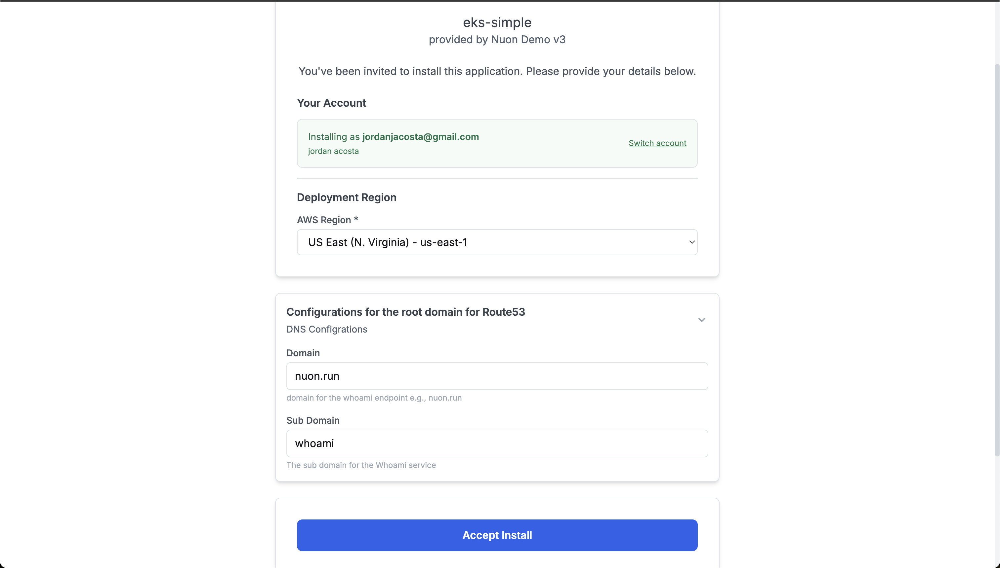
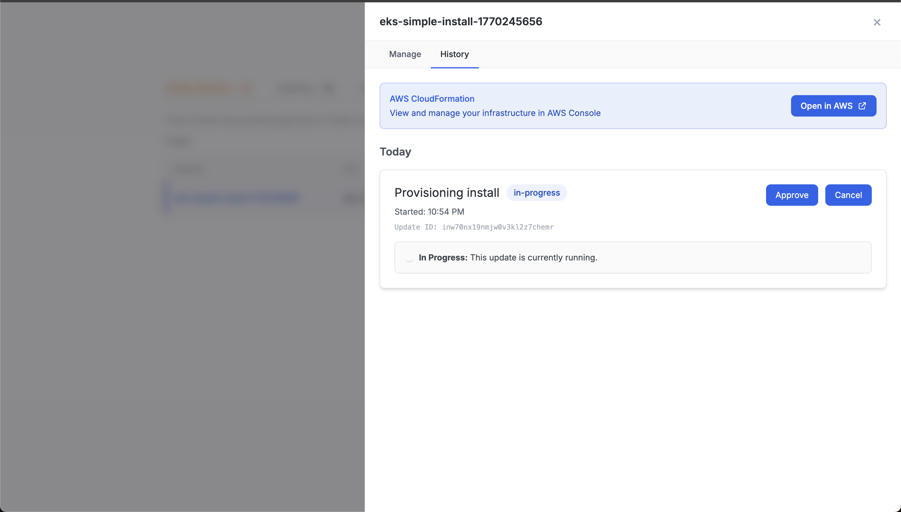
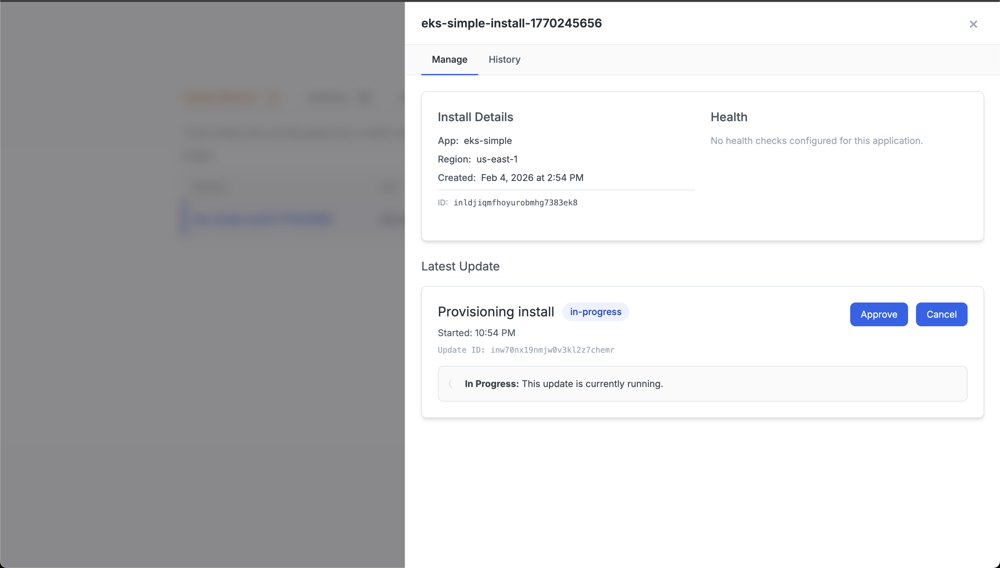

The Customer Portal will have you up and running in minutes. But, as your BYOC offering matures, you may want to integrate install management more seamlessly into your own application.

All the features of the Nuon platform are exposed via a REST API, allowing for fully programmatic operation. We also maintain a Golang SDK, which we use ourselves for the Dashboard and CLI. This guide will walk through how to implement a complete install lifecycle using the API.

<Note>
If you would like a working example, our [Customer Portal](https://customers.nuon.co/admin/login/) integrates with the Nuon Cloud API, using the API calls documented here.
</Note>

## Provision an Install

At a high-level, provisioning a new install consists of 3 steps:

1. Creating the install in the Nuon control plane.
1. Installing the runner in the customer's cloud account.
1. Approving the provision of the app components into the customer's cloud account.

### Create an Install

<CodeGroup>
```bash curl
curl -X POST https://api.nuon.co/v1/installs \
  -H "Authorization: Bearer $NUON_API_TOKEN" \
  -H "X-Nuon-Org-ID: $NUON_ORG_ID" \
  -H "Content-Type: application/json" \
  -d '{
    "app_id": "app...",
    "name": "acme-corp-production",
    "aws_account": {
      "region": "us-west-2"
    },
    "inputs": {
      "domain": "acme.example.com"
    }
  }'
```

```go Go
import (
    "context"
    "os"

    nuon "github.com/nuonco/nuon-go"
    "github.com/nuonco/nuon-go/models"
)

func main() {
    client, _ := nuon.New(
        nuon.WithAuthToken(os.Getenv("NUON_API_TOKEN")),
        nuon.WithOrgID(os.Getenv("NUON_ORG_ID")),
    )

    name := "acme-corp-production"
    install, workflowID, err := client.CreateInstall(
        context.Background(),
        "app...",
        &models.ServiceCreateInstallRequest{
            Name: &name,
            AwsAccount: &models.ServiceCreateInstallRequestAwsAccount{
                Region: "us-west-2",
            },
            Inputs: map[string]string{
                "domain": "acme.example.com",
            },
        },
    )
}
```
</CodeGroup>



### Install the Runner

Installing the runner happens out of band, entirely on the customer's side. You just need to provide them with directions. We provide these for each install as part of the provision workflow. It will either be a link to a Cloudformation stack (for AWS app,) or the Azure CLI command to deploy a resource stack (for Azure apps.)



Once the runner is installed, it will phone home automatically.

### Approve the Provision

Once the runner is installed, it will be ready to provision the sandbox and app components. In the Dashboard, we allow you to approve all steps, or one step at a time. Typically, the customer will want to approve resources being created in their account, so we recommend exposing this to them. In the Customer Portal, the "Approve" button we show to the customer maps to "Approve All" to keep the experience simple.

<Note>
The `workflowID` is returned when creating the install. You will need to store this to approve the provision workflow.
</Note>

<CodeGroup>
```bash curl
curl -X PATCH https://api.nuon.co/v1/workflows/$WORKFLOW_ID \
  -H "Authorization: Bearer $NUON_API_TOKEN" \
  -H "X-Nuon-Org-ID: $NUON_ORG_ID" \
  -H "Content-Type: application/json" \
  -d '{"approval_option": "approve-all"}'
```

```go Go
approveAll := models.AppInstallApprovalOptionApproveDashAll
workflow, err := client.UpdateWorkflow(
    context.Background(),
    workflowID,
    &models.ServiceUpdateWorkflowRequest{
        ApprovalOption: &approveAll,
    },
)
```
</CodeGroup>



## Maintain an Install

Even though the goal of using Nuon it to provide a SaaS-like experience, where you can maintain the install for your customer, there are still a few things they will need to be able to do themselves. Common use cases are:

- Accepting a new version of the app
- Allowing you to break glass to triage an issue
- Updating an input value that was incorrect
- Updating a secret that was incorrect
- Inspecting audit trails for compliance reasons

We will cover the API calls needed for these use-cases here.

### Update Inputs

<CodeGroup>
```bash curl
curl -X PATCH https://api.nuon.co/v1/installs/$INSTALL_ID/inputs \
  -H "Authorization: Bearer $NUON_API_TOKEN" \
  -H "X-Nuon-Org-ID: $NUON_ORG_ID" \
  -H "Content-Type: application/json" \
  -d '{
    "inputs": {
      "domain": "new-domain.example.com",
      "replicas": "3"
    }
  }'
```

```go Go
inputs, workflowID, err := client.UpdateInstallInputs(
    context.Background(),
    installID,
    &models.ServiceUpdateInstallInputsRequest{
        Inputs: map[string]string{
            "domain":   "new-domain.example.com",
            "replicas": "3",
        },
    },
)
```
</CodeGroup>

### Update Secrets

<CodeGroup>
```bash curl
curl -X POST https://api.nuon.co/v1/installs/$INSTALL_ID/sync-secrets \
  -H "Authorization: Bearer $NUON_API_TOKEN" \
  -H "X-Nuon-Org-ID: $NUON_ORG_ID" \
  -H "Content-Type: application/json" \
  -d '{"plan_only": false}'
```

```go Go
// SyncSecrets is not yet exposed in the public SDK.
// Use the REST API directly or contact support for SDK updates.
```
</CodeGroup>

## Delete an Install

Uninstalling an app requires performing the same operations as a provision, but in reverse.

1. Deprovision the app resources from your customer's cloud account.
1. Uninstall the runner.
1. Delete the install from the control plane.

### Deprovision the App

To deprovision the app resources and sandbox, you will need to run an install deprovision workflow. Just like the provision workflow, ths will require approvals. In the Customer Portal, we keep this experience simple by showing the customer a single "Approval" and mapping that to "Approve All".

<CodeGroup>
```bash curl
curl -X POST https://api.nuon.co/v1/installs/$INSTALL_ID/deprovision \
  -H "Authorization: Bearer $NUON_API_TOKEN" \
  -H "X-Nuon-Org-ID: $NUON_ORG_ID" \
  -H "Content-Type: application/json" \
  -d '{"plan_only": false}'
```

```go Go
err := client.DeprovisionInstall(context.Background(), installID)
```
</CodeGroup>

### Uninstall the Runner

Just like installing the runner, uninstalling it happens out of band. For AWS apps, your customer must deprovision the Cloudformation stack. For Azure apps, your customer must run an Azure CLI command. These are provided in the deprovision workflow.

### Delete the Install

Once all the resources have been removed from your customer's cloud account, you can delete the install from the control plane.

<CodeGroup>
```bash curl
curl -X DELETE https://api.nuon.co/v1/installs/$INSTALL_ID \
  -H "Authorization: Bearer $NUON_API_TOKEN" \
  -H "X-Nuon-Org-ID: $NUON_ORG_ID"
```

```go Go
deleted, err := client.DeleteInstall(context.Background(), installID)
```
</CodeGroup>

## Forget an Install

Sometimes, an install can get into a bad enough state that you cannot even run deprovision operations. Usually, this means something catastrophic has happened out of band in the customer's account, and it would be easier for Nuon to simply forget the current install and re-install the app from scratch.

<CodeGroup>
```bash curl
curl -X POST https://api.nuon.co/v1/installs/$INSTALL_ID/forget \
  -H "Authorization: Bearer $NUON_API_TOKEN" \
  -H "X-Nuon-Org-ID: $NUON_ORG_ID" \
  -H "Content-Type: application/json" \
  -d '{}'
```

```go Go
forgotten, err := client.ForgetInstall(context.Background(), installID)
```
</CodeGroup>
