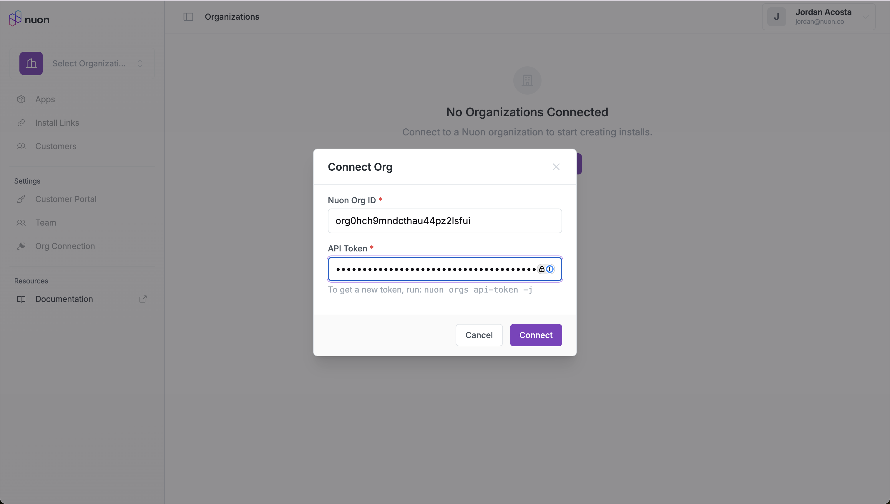
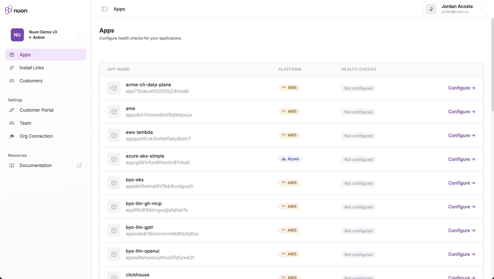
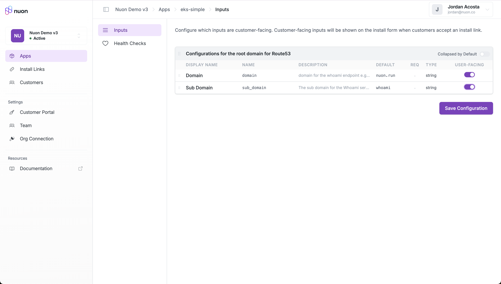
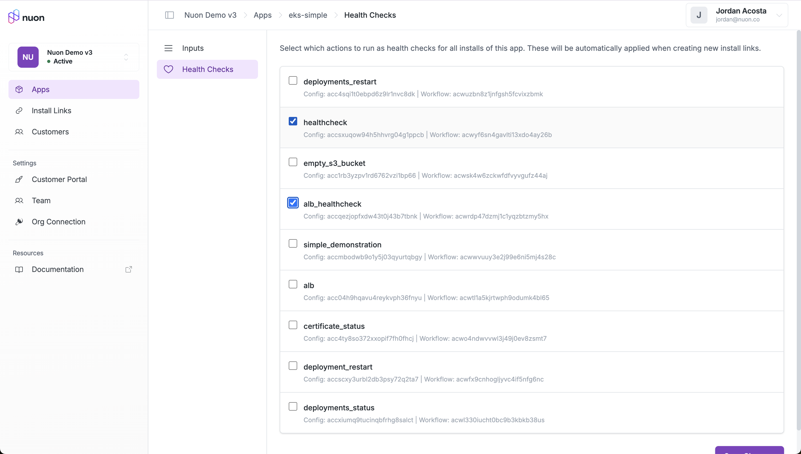
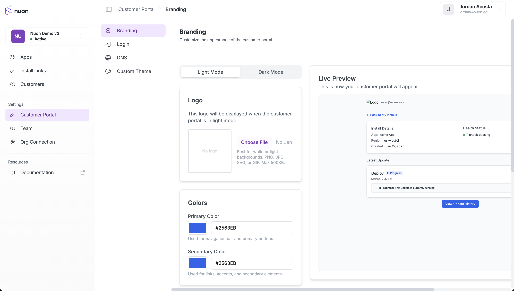
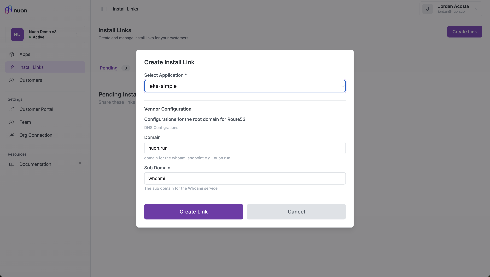
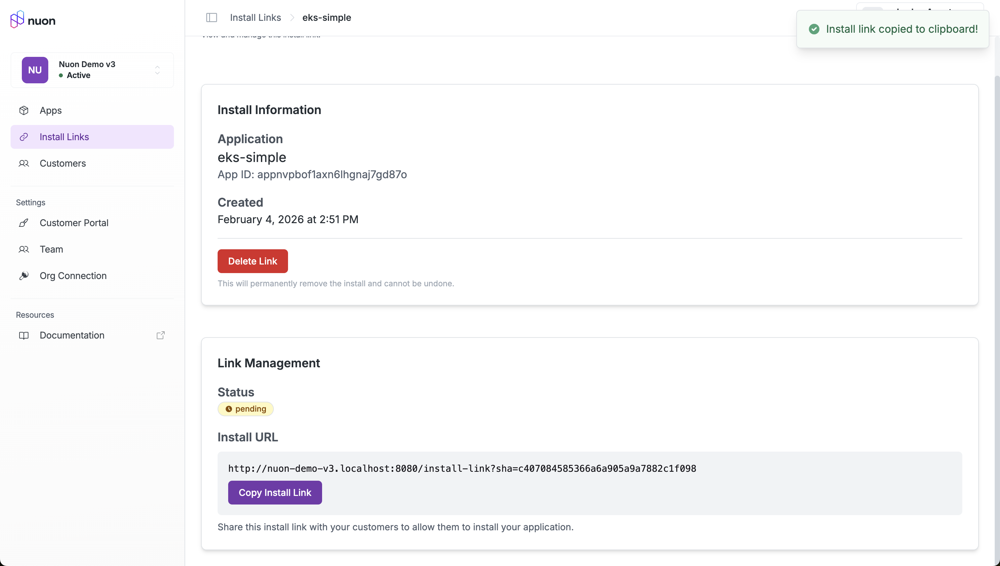

When your BYOC app is ready for customers to install, the easiest way to get started is to use the [Customer Portal](https://customers.nuon.co/). It provides a complete, end-to-end, branded experience for your customers.

## Getting Started

### Connect your Org

The first step is to connect the Portal to your Nuon org, so it can access your app and install data. You will need the org ID and an API token. You can create an API token using the Nuon CLI.

```sh
nuon orgs api-token -j
```

<Note>
The API token will be used to fetch data from the API for customer-facing pages.
</Note>

Log into the Portal admin, and click "Connect Org" in the org selector. Provide your org ID and token, and click "Connect".



Once your org is connected, you should see all of your apps in the Apps section.



### Configure your App

In the settings for each app, configure what customers will see during the installation process.

#### Inputs

In the input settings, configure what inputs customers will see on the install creation form.



#### Health Checks

In the health check settings, select the actions you want to use as health checks for that app. They will be used to determine when the app is ready for customer to use.



### Configure the Portal

Each connected org is given it's own portal, hosted at `https://<your-org-name>.customers.nuon.co`. This is where your customers will login to manage their installs. In the Customer Portal settings, you can configure branding, login, and the subdomain. You can also create a custom theme if you want full control over the look and feel.



## Invite Customers

Once your org is connected and your apps configured, you are ready to start inviting customers to install your app.

### Create an Install Link

Install links are how you invite your customers to install your app. Install links are single-use. To create an install link, go to the Install Links page and click "Create Link". Select the app you want to create a link for, fill out any inputs that aren't customer-facing, and click "Create Link".



Once the link is created, click on "Copy Install Link", and send it to your customer.



When the customer clicks on the link, they will be taken to your branded portal to install the app.

### Install the App

When your customer follows the link, they will be shown an install creation form. When they fill out the required inputs and click "Accept Install", the new install will be added to their account.

<Note>
If your customer has never logged into the portal before, they will be redirected to the portal login, and then redirected back to the install form after logging in.
</Note>


Creating the install will kick off a provision workflow. You will see the new install in the Dashboard, and can monitor the workflow there. The portal provides the same functionality with a more streamlined experience.

#### Install the Runner

The first step for your customer in this workflow is to install the runner. Once the workflow reaches the "Await Install" step, the portal will update to show them the installation instructions.


#### Approve the App Installation

When the runner is ready to provision your app, the customer will be shown an approval button. This is equivalent to "Approve All" in the Dashboard, and will allow the runner to provsion the sandbox and your app components.


#### Access the App

Once all the configured health checks have passed, your customer will be shown that the app is ready to use. Include links they can access in your app's readme to make it easy for them to find.
