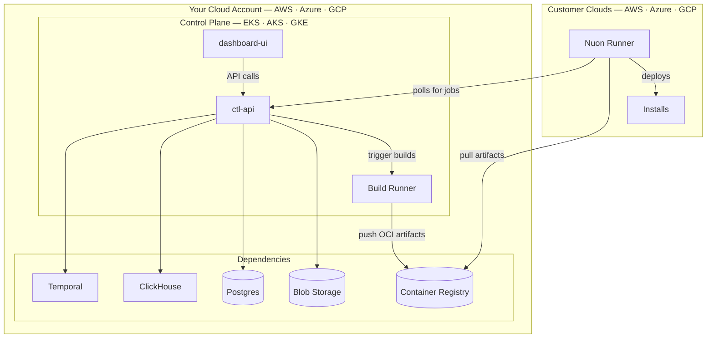

Self-Hosted Nuon is a single-tenant Nuon control plane running in your own AWS, Azure, or Google Cloud account, with no path for Nuon to reach in. It is the most disconnected deployment option: you install it, operate it, and upgrade it.

This is the same software as [Nuon BYOC](/guides/byoc), but without the remote operator. There is no Nuon Runner in your account polling Nuon Cloud for jobs, no managed upgrades, and no remote troubleshooting. In exchange, the installation has no mechanism for Nuon to access — useful for compliance, sovereignty, or air-gap requirements where any remote-managed control plane (even a single-tenant one) is ruled out.

Self-Hosted Nuon requires a paid license. [Contact sales](https://nuon.co/contact-sales) to get started.

## Architecture

Your control plane runs in your cloud account with no connection to Nuon. Customer Runners poll your control plane for jobs and pull artifacts from your container registry — the same flow as every other deployment model.

## Operational Responsibility

Self-hosting means you own the full lifecycle of the Nuon control plane:

- **Upgrades** — you apply new Nuon releases. There is no Nuon Runner in your account to do this remotely.
- **Backup and restore** — your Postgres, blob storage, and container registry are yours to back up and recover.
- **Monitoring and alerting** — wire your own observability into the control plane services.
- **Troubleshooting** — Nuon engineers cannot remotely inspect logs, run diagnostics, or apply hotfixes. Support is limited to guidance you can act on yourself.

## Supported Platforms

- [AWS](/guides/self-hosted/aws) — Nuon deploys on EKS with RDS, ECR, Route 53, ACM, and Secrets Manager.
- [Azure](/guides/self-hosted/azure) — AKS with Azure SQL, ACR, Blob Storage, and Key Vault.
- [GCP](/guides/self-hosted/gcp) — GKE with Cloud SQL, GAR, GCS, and Secret Manager.
