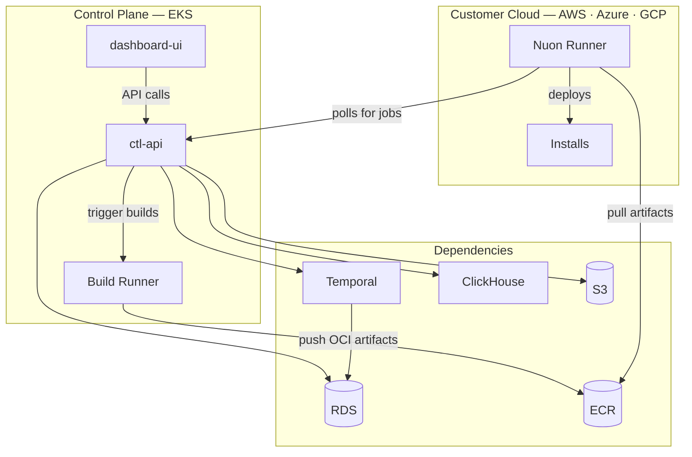

In addition to the Nuon BYOC offering, Nuon supports fully self-hosted deployments. The guides below cover cloud-specific setup.

## Architecture

## Supported Platforms

- [AWS](/guides/self-hosted/aws) — Nuon deploys on EKS with RDS, ECR, Route 53, ACM, and Secrets Manager.
- [Azure](/guides/self-hosted/azure) — Azure AKS support.
- [GCP](/guides/self-hosted/gcp) — GCP support.
