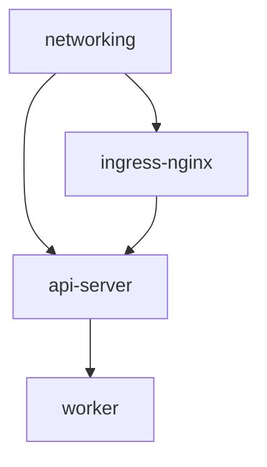
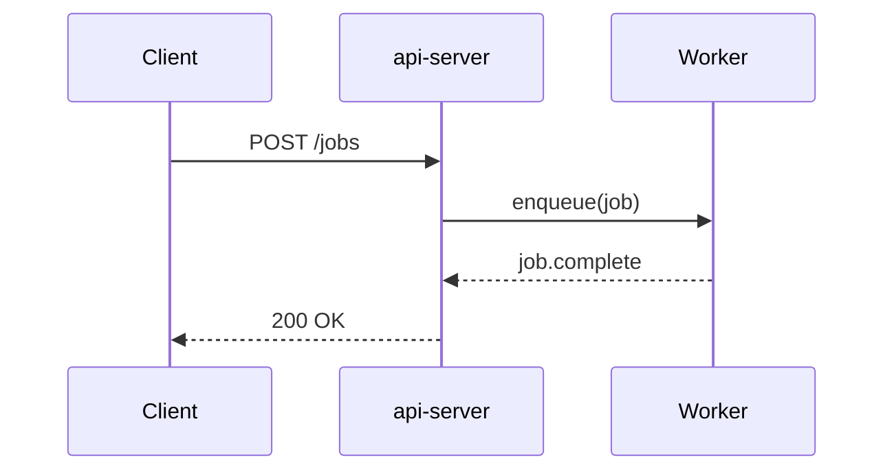

Define a README on your app; Nuon renders it on each install's **Overview**.
This guide covers authoring and formatting. For per-install variables and live
data components, see [Programmable READMEs](/guides/programmable-readmes).

## Adding a README to an app

Set the `readme` field on your app:

```toml metadata.toml
# metadata
name = "My App"
readme = "This is the README for My App."
```

Sync, and it renders on each install's Overview.

## Formatting

The `readme` is a string, rendered as Markdown in the dashboard. Use TOML
multi-line strings for readability:

```toml metadata.toml
# metadata
name = "My App"
readme = """
# My App

This is the README for My App.

## Sandbox

This app uses the nuonco/aws-eks-sandbox.

## Components

This app consists of the following components.

| Name | Type |
|------|------|
| api | container_image |
| deployment | helm_chart |

"""
```

<Note>
	Markdown accepts HTML, so HTML/CSS/JS works too, but not all of it renders
	reliably in the dashboard. Proceed with caution.
</Note>

## Reference a README.md file

Reference a `README.md` file instead of inlining. It's easier to manage for longer
documents:

```toml metadata.toml
# metadata
version = "v2"

description = "Grafana App Config"
display_name = "Grafana App Config"
readme       = "./README.md"
```

## Tables

Markdown tables render with styled headers and auto-scroll horizontally when
the content is wider than the page.

```markdown README.md
| Component | Type | Port | Health check |
|-----------|------|------|--------------|
| api-server | docker_build | 8080 | /healthz |
| worker | docker_build | — | — |
| ingress-nginx | helm_chart | 443 | /ready |
| networking | terraform_module | — | — |
```

## Collapsible sections

Use HTML `<details>` and `<summary>` tags to create expandable sections. These
render with styled expand/collapse behavior, including a rotate animation on
the chevron icon.

````markdown README.md
<details>
<summary>Troubleshooting: pod stuck in CrashLoopBackOff</summary>

1. Check the pod logs for the failing container:

   ```bash
   kubectl logs -n {{.nuon.install.name}} deploy/api-server --previous
   ```

2. Verify the config map has the correct values:

   ```bash
   kubectl get configmap app-config -n {{.nuon.install.name}} -o yaml
   ```

3. If the issue persists, re-run the **deploy components** action.

</details>
````

You can include any Markdown inside a collapsible section: lists, code blocks,
tables, and even nested `<details>`.

## Code blocks

Fenced code blocks with a language identifier get syntax highlighting.

````markdown README.md
```bash
nuon installs deploy --install-id {{.nuon.install.id}} --component api-server
```

```go
func healthCheck(w http.ResponseWriter, r *http.Request) {
    w.WriteHeader(http.StatusOK)
    w.Write([]byte("ok"))
}
```
````

Supported languages include `bash`, `go`, `typescript`, `python`, `hcl`, `yaml`,
`sql`, and many more.

JSON code blocks render as an interactive tree viewer that you can expand and
collapse:

````markdown README.md
```json
{
  "cluster": "eks-production",
  "region": "us-west-2",
  "node_pools": [
    { "name": "default", "instance_type": "m5.xlarge", "min": 2, "max": 10 }
  ]
}
```
````

## Mermaid diagrams

Code blocks with the `mermaid` language render as diagrams.

**Flowcharts** (`graph TD`, `flowchart LR`, etc.) render as interactive diagrams
with pan, zoom, and drag via ReactFlow. Supported directions: `TD`, `TB`, `LR`,
`RL`, `BT`.

````markdown README.md

````

Flowcharts support subgraphs, edge labels, node shapes, and custom styling via
`style` directives.

**All other diagram types** (sequence, class, state, etc.) render as static SVG:

````markdown README.md

````

## Callouts

READMEs support GitHub-style callout blockquotes. These render with a colored
left border, icon, and label.

```markdown README.md
> [!NOTE]
> Highlights information that users should take into account, even when skimming.

> [!TIP]
> Optional information to help a user be more successful.

> [!IMPORTANT]
> Crucial information necessary for users to succeed.

> [!WARNING]
> Critical content demanding immediate user attention due to potential risks.

> [!CAUTION]
> Negative potential consequences of an action.
```

Five types are supported: `NOTE` (blue), `TIP` (green), `IMPORTANT` (purple),
`WARNING` (orange), and `CAUTION` (red). Regular blockquotes without a type
prefix render normally.

## Local time

Use the `<nuon-time>` tag to render timestamps in the viewer's local timezone.

```markdown README.md
Last deployed <nuon-time time="2024-06-15T10:30:00Z" format="relative"></nuon-time>

Maintenance window: <nuon-time time="2024-07-01T02:00:00Z" format="long-datetime"></nuon-time>
```

Attributes:
- `time` — ISO 8601 timestamp string
- `seconds` — Unix timestamp (alternative to `time`)
- `format` — `relative` (e.g. "2 hours ago"), `short-datetime`, `long-datetime`,
  `time-only` (defaults to `short-datetime`)

The `relative` format auto-updates and shows a tooltip with the full date on
hover.

## Display components

READMEs support custom `<nuon-*>` HTML tags that render as dashboard UI
components. These are purely presentational and work in both app-level and
install-level views.

### Badge

Renders an inline badge.

```markdown README.md
<nuon-badge theme="success" size="sm">healthy</nuon-badge>
<nuon-badge theme="error" variant="code">degraded</nuon-badge>
```

Attributes:
- `theme` — `brand`, `default`, `neutral`, `success`, `warn`, `error`, `info`
- `size` — `sm`, `md`, `lg`
- `variant` — `default`, `code`

### Label badge

Renders a key/value label badge — useful for tagging installs with metadata like
environment, region, or version.

```markdown README.md
<nuon-label-badge label="env:production"></nuon-label-badge>
<nuon-label-badge key="region" value="us-east-1" theme="warn"></nuon-label-badge>
<nuon-label-badge label="sha:a1b2c3d" variant="code" theme="success"></nuon-label-badge>
```

You can pass the label as a single colon-separated `label` attribute, or as
separate `key` and `value` attributes.

Attributes:
- `label` — colon-separated key:value string (e.g. `env:production`)
- `key` — label key (alternative to `label`)
- `value` — label value (alternative to `label`)
- `theme` — `brand`, `default`, `neutral`, `success`, `warn`, `error`, `info`
- `key-theme` — override the theme for just the key portion
- `size` — `sm`, `md`, `lg`
- `variant` — `default`, `code`

### Banner

Renders a callout banner for important notices.

```markdown README.md
<nuon-banner theme="warn">
This app requires a NAT gateway in the target VPC. Ensure one exists before
creating an install.
</nuon-banner>
```

Attributes:
- `theme` — `brand`, `default`, `neutral`, `success`, `warn`, `error`, `info`

### Status

Renders a status indicator dot with label.

```markdown README.md
<nuon-status status="active" variant="badge"></nuon-status>
```

Attributes:
- `status` — any string (e.g. `active`, `provisioning`, `error`)
- `variant` — `default`, `badge`, `timeline`

### Group

A flexbox layout container for arranging other elements.

```markdown README.md
<nuon-group gap="8" align="center" justify="start">
  <nuon-badge theme="info">v2.4.1</nuon-badge>
  <nuon-badge theme="success">production</nuon-badge>
  <nuon-badge theme="warn">us-west-2</nuon-badge>
</nuon-group>
```

Attributes: `gap` (number), `align`, `justify`, `wrap` (`"true"` or `"false"`,
defaults to true).

### Card

Wraps content in a styled card container with border, padding, and shadow.

```markdown README.md
<nuon-card>

## Quick reference

| Variable | Default | Description |
|----------|---------|-------------|
| `REPLICAS` | `2` | Number of API server replicas |
| `LOG_LEVEL` | `info` | Application log level |

</nuon-card>
```

Attributes:
- `class` — optional CSS class name for custom styling

### Tabs

Renders tabbed content sections. Wrap `<nuon-tab>` elements inside a
`<nuon-tabs>` block:

```markdown README.md
<nuon-tabs>
<nuon-tab name="Quick start">

1. Create an install from the dashboard
2. Run the **deploy components** action
3. Verify the health check endpoint returns 200

</nuon-tab>
<nuon-tab name="Configuration">

| Variable | Default | Description |
|----------|---------|-------------|
| `REPLICAS` | `2` | Number of API server replicas |
| `LOG_LEVEL` | `info` | Application log level |

</nuon-tab>
</nuon-tabs>
```

Each `<nuon-tab>` requires a `name` attribute. The content inside each tab is
full markdown.

### Modal

Renders a button that opens a modal dialog containing markdown content.

```markdown README.md
<nuon-modal heading="Architecture overview" trigger="View architecture" size="lg">

## System architecture

The application consists of three layers:

1. **Ingress** — NGINX handles TLS termination and routing
2. **API** — Go service processing requests
3. **Workers** — Async job processing via Temporal

</nuon-modal>
```

Attributes: `heading`, `trigger` (button label, defaults to "View"), `size`.

### Panel

Same as modal, but slides in from the side of the screen.

```markdown README.md
<nuon-panel heading="Runbook: rotate credentials" trigger="Open runbook">

1. Generate new credentials in the target cloud account
2. Update the install config with the new values
3. Re-run **deploy components**
4. Verify connectivity with the health check

</nuon-panel>
```

Attributes: `heading`, `trigger` (button label, defaults to "View"), `size`.


## Render per-install values

Everything above is static authoring. To render each install's live values and embed real-time components (status cards, the config graph, runnable runbooks), see [Programmable READMEs](/guides/programmable-readmes).
