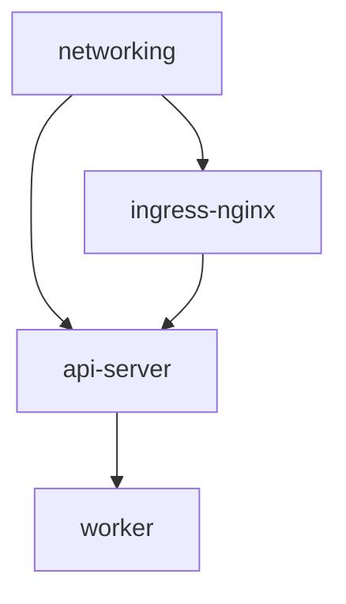
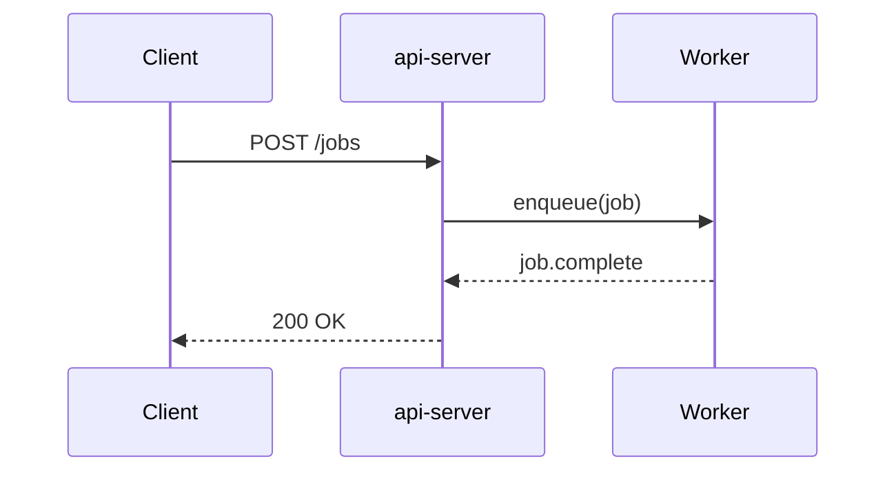

App READMEs allow you to define documentation for an App that can be rendered
per-install. This guide will get you started using READMEs to support operating
installs of your apps.

## Adding a README to an App

To add a README to an App, define the `readme` field in your app. We'll start
with something simple.

```toml metadata.toml
# metadata
name = "My App"
readme = "This is the README for My App."
```

Sync your config, and you should see this rendered on the Overview of each
install of that app.

## Formatting

READMEs are technically just a string field, but our rendering in the dashboard
supports Markdown. You can also use TOML's multi-line strings to make formatting
easier. Let's use both to add some more structure and content.

```toml metadata.toml
# metadata
name = "My App"
readme = """
# My App

This is the README for My App.

## Sandbox

This app uses the nuonco/aws-eks-sandbox.

## Components

This app consists of the following components.

| Name | Type |
|------|------|
| api | container_image |
| deployment | helm_chart |

"""
```

<Note>
	Because Markdown accepts HTML, you can also use HTML/CSS/JS. However, we can't
	gaurantee that all valid HTML/CSS/JS will work when rendered in the dashboard.
	Proceed with caution.
</Note>

## Reference a README.md file

To cleanly separate markdown from TOML, you can reference a `README.md` file in
your app directory. This is often easier to manage, especially for longer
documents.

```toml metadata.toml
# metadata
version = "v2"

description = "Grafana App Config"
display_name = "Grafana App Config"
readme       = "./README.md"
```

## Variables

READMEs support variables. These will be rendered server-side in the context of
each install, just as they are in component and actions fields. We will use
variables here to add some install info. We can also parametrize the app info,
to make sure the README is up to date if we change the app later.

```toml metadata.toml
# metadata
name = "My App"
readme = """
# {{.nuon.app.name}}

This is the README for {{.nuon.app.name}} in install {{.nuon.install.name}}.

## Sandbox

This app uses the {{.nuon.sandbox.type}} sandbox.

## Components

This app consists of the following components.

- api
- deployment

```

Additionally, because READMEs are designed to be rendered on a webpage, and
variables use Golang templating, you have access to the full power of
[Golang's templating language](https://pkg.go.dev/text/template). Let's use that
to add component statuses.

```toml metadata.toml
# metadata
name = "My App"
readme = """
# {{.nuon.app.name}}

This is the README for {{.nuon.app.name}} in install {{.nuon.install.name}}.

## Sandbox

This app uses the {{.nuon.sandbox.type}} sandbox.

## Components

{{ if .nuon.components.populated }}

This install is running the following app components.

| Name | Status |
|------|------|
{{- range $name, $component := .nuon.components.components }}
| `{{ $name }}` | `{{ $component.status }}` |
{{- end }}

{{ else }}

__No app components are active in this install. You may need to run "Deploy Components" for this install.__

{{ end }}

```

Because the dashboard polls the Control Plane, you will get near-real-time
statuses for each component.

## Tables

Markdown tables render with styled headers and auto-scroll horizontally when
the content is wider than the page.

```markdown README.md
| Component | Type | Port | Health check |
|-----------|------|------|--------------|
| api-server | docker_build | 8080 | /healthz |
| worker | docker_build | — | — |
| ingress-nginx | helm_chart | 443 | /ready |
| networking | terraform_module | — | — |
```

## Collapsible sections

Use HTML `<details>` and `<summary>` tags to create expandable sections. These
render with styled expand/collapse behavior, including a rotate animation on
the chevron icon.

````markdown README.md
<details>
<summary>Troubleshooting: pod stuck in CrashLoopBackOff</summary>

1. Check the pod logs for the failing container:

   ```bash
   kubectl logs -n {{.nuon.install.name}} deploy/api-server --previous
   ```

2. Verify the config map has the correct values:

   ```bash
   kubectl get configmap app-config -n {{.nuon.install.name}} -o yaml
   ```

3. If the issue persists, re-run the **deploy components** action.

</details>
````

You can include any markdown inside a collapsible section — lists, code blocks,
tables, and even nested `<details>`.

## Code blocks

Fenced code blocks with a language identifier get syntax highlighting.

````markdown README.md
```bash
nuon installs deploy --install-id {{.nuon.install.id}} --component api-server
```

```go
func healthCheck(w http.ResponseWriter, r *http.Request) {
    w.WriteHeader(http.StatusOK)
    w.Write([]byte("ok"))
}
```
````

Supported languages include `bash`, `go`, `typescript`, `python`, `hcl`, `yaml`,
`sql`, and many more.

JSON code blocks render as an interactive tree viewer that you can expand and
collapse:

````markdown README.md
```json
{
  "cluster": "eks-production",
  "region": "us-west-2",
  "node_pools": [
    { "name": "default", "instance_type": "m5.xlarge", "min": 2, "max": 10 }
  ]
}
```
````

## Mermaid diagrams

Code blocks with the `mermaid` language render as diagrams.

**Flowcharts** (`graph TD`, `flowchart LR`, etc.) render as interactive diagrams
with pan, zoom, and drag via ReactFlow. Supported directions: `TD`, `TB`, `LR`,
`RL`, `BT`.

````markdown README.md

````

Flowcharts support subgraphs, edge labels, node shapes, and custom styling via
`style` directives.

**All other diagram types** (sequence, class, state, etc.) render as static SVG:

````markdown README.md

````

## Display components

READMEs support custom `<nuon-*>` HTML tags that render as dashboard UI
components. These are purely presentational and work in both app-level and
install-level views.

### Badge

Renders an inline badge.

```markdown README.md
<nuon-badge theme="success" size="sm">healthy</nuon-badge>
<nuon-badge theme="error" variant="code">degraded</nuon-badge>
```

Attributes:
- `theme` — `brand`, `default`, `neutral`, `success`, `warn`, `error`, `info`
- `size` — `sm`, `md`, `lg`
- `variant` — `default`, `code`

### Label badge

Renders a key/value label badge — useful for tagging installs with metadata like
environment, region, or version.

```markdown README.md
<nuon-label-badge label="env:production"></nuon-label-badge>
<nuon-label-badge key="region" value="us-east-1" theme="warn"></nuon-label-badge>
<nuon-label-badge label="sha:a1b2c3d" variant="code" theme="success"></nuon-label-badge>
```

You can pass the label as a single colon-separated `label` attribute, or as
separate `key` and `value` attributes.

Attributes:
- `label` — colon-separated key:value string (e.g. `env:production`)
- `key` — label key (alternative to `label`)
- `value` — label value (alternative to `label`)
- `theme` — `brand`, `default`, `neutral`, `success`, `warn`, `error`, `info`
- `key-theme` — override the theme for just the key portion
- `size` — `sm`, `md`, `lg`
- `variant` — `default`, `code`

### Banner

Renders a callout banner for important notices.

```markdown README.md
<nuon-banner theme="warn">
This app requires a NAT gateway in the target VPC. Ensure one exists before
creating an install.
</nuon-banner>
```

Attributes:
- `theme` — `brand`, `default`, `neutral`, `success`, `warn`, `error`, `info`

### Status

Renders a status indicator dot with label.

```markdown README.md
<nuon-status status="active" variant="badge"></nuon-status>
```

Attributes:
- `status` — any string (e.g. `active`, `provisioning`, `error`)
- `variant` — `default`, `badge`, `timeline`

### Group

A flexbox layout container for arranging other elements.

```markdown README.md
<nuon-group gap="8" align="center" justify="start">
  <nuon-badge theme="info">v2.4.1</nuon-badge>
  <nuon-badge theme="success">production</nuon-badge>
  <nuon-badge theme="warn">us-west-2</nuon-badge>
</nuon-group>
```

Attributes: `gap` (number), `align`, `justify`, `wrap` (`"true"` or `"false"`,
defaults to true).

### Tabs

Renders tabbed content sections. Wrap `<nuon-tab>` elements inside a
`<nuon-tabs>` block:

```markdown README.md
<nuon-tabs>
<nuon-tab name="Quick start">

1. Create an install from the dashboard
2. Run the **deploy components** action
3. Verify the health check endpoint returns 200

</nuon-tab>
<nuon-tab name="Configuration">

| Variable | Default | Description |
|----------|---------|-------------|
| `REPLICAS` | `2` | Number of API server replicas |
| `LOG_LEVEL` | `info` | Application log level |

</nuon-tab>
</nuon-tabs>
```

Each `<nuon-tab>` requires a `name` attribute. The content inside each tab is
full markdown.

### Modal

Renders a button that opens a modal dialog containing markdown content.

```markdown README.md
<nuon-modal heading="Architecture overview" trigger="View architecture" size="lg">

## System architecture

The application consists of three layers:

1. **Ingress** — NGINX handles TLS termination and routing
2. **API** — Go service processing requests
3. **Workers** — Async job processing via Temporal

</nuon-modal>
```

Attributes: `heading`, `trigger` (button label, defaults to "View"), `size`.

### Panel

Same as modal, but slides in from the side of the screen.

```markdown README.md
<nuon-panel heading="Runbook: rotate credentials" trigger="Open runbook">

1. Generate new credentials in the target cloud account
2. Update the install config with the new values
3. Re-run **deploy components**
4. Verify connectivity with the health check

</nuon-panel>
```

Attributes: `heading`, `trigger` (button label, defaults to "View"), `size`.

## Data-bound components

These `<nuon-*>` tags render live install data from the dashboard. They require
install context — when viewed at the app level (before selecting an install),
they render as inline code showing the raw tag.

### Config graph

Shows the install's dependency graph of components and infrastructure.

```markdown README.md
<nuon-config-graph></nuon-config-graph>
```

### View state

Renders a button that opens the install state viewer.

```markdown README.md
<nuon-view-state></nuon-view-state>
```

### Runner card

Shows the status card for the install's runner.

```markdown README.md
<nuon-runner-card></nuon-runner-card>
```

### Sandbox card

Shows the status card for the install's sandbox.

```markdown README.md
<nuon-sandbox-card></nuon-sandbox-card>
```

### Component card

Shows the status card for a specific component. Reference by `name` or `id`.

```markdown README.md
<nuon-component-card name="api-server"></nuon-component-card>
<nuon-component-card name="ingress-nginx"></nuon-component-card>
```

Attributes: `name`, `id`.

### Stack card

Shows the status card for the install's stack (grouped deploy history).

```markdown README.md
<nuon-stack-card></nuon-stack-card>
```

### Action card

Shows the status card for a specific action. Reference by `name` or `id`.

```markdown README.md
<nuon-action-card name="deploy-canary"></nuon-action-card>
<nuon-action-card name="rollback"></nuon-action-card>
```

Attributes: `name`, `id`.

<Tip>
Data-bound components are most useful in the referenced `README.md` file format,
where you can build rich install dashboards combining live status cards with
documentation.
</Tip>

## Putting it all together

Here's an example README that combines variables, display components, and
data-bound components into an install operations page:

````markdown README.md
# {{.nuon.app.name}}

<nuon-banner theme="info">
This README is rendered per-install. Component statuses update in real time.
</nuon-banner>

<nuon-tabs>
<nuon-tab name="Status">

## Infrastructure

<nuon-group gap="16">
  <nuon-runner-card></nuon-runner-card>
  <nuon-sandbox-card></nuon-sandbox-card>
</nuon-group>

## Components

<nuon-component-card name="networking"></nuon-component-card>
<nuon-component-card name="ingress-nginx"></nuon-component-card>
<nuon-component-card name="api-server"></nuon-component-card>

</nuon-tab>
<nuon-tab name="Actions">

<nuon-action-card name="deploy-canary"></nuon-action-card>
<nuon-action-card name="rollback"></nuon-action-card>

</nuon-tab>
<nuon-tab name="Architecture">


</nuon-tab>
</nuon-tabs>
````

## Conclusion

You should now have the basic info you need to get started creating READMEs for
your own apps.
