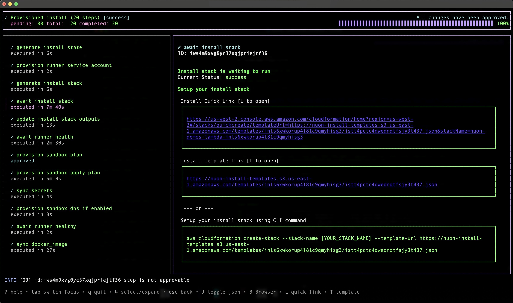
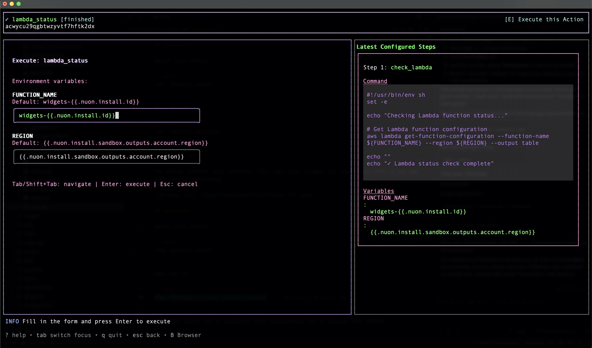

## Workflow TUI

Our workflow terminal user interface (TUI) lets users manage and follow the steps of an install in real time.

Review plan diffs, approve steps, retry failed actions, and cancel workflows when needed.

We designed this TUI to make working in our CLI faster and easier.



## Quickstart

Select your install

```bash
nuon installs select
```

Open the TUI

```bash
nuon installs workflows
```

## Actions TUI

The action terminal user interface (TUI) lets users trigger and view action runs in any app with actions configured.



## Quickstart

Select your install

```bash
nuon installs select
```

Open the TUI

```bash
NUON_PREVIEW=true nuon installs actions
```

<Note>The action TUI is currently still experimental and in preview mode.</Note>
