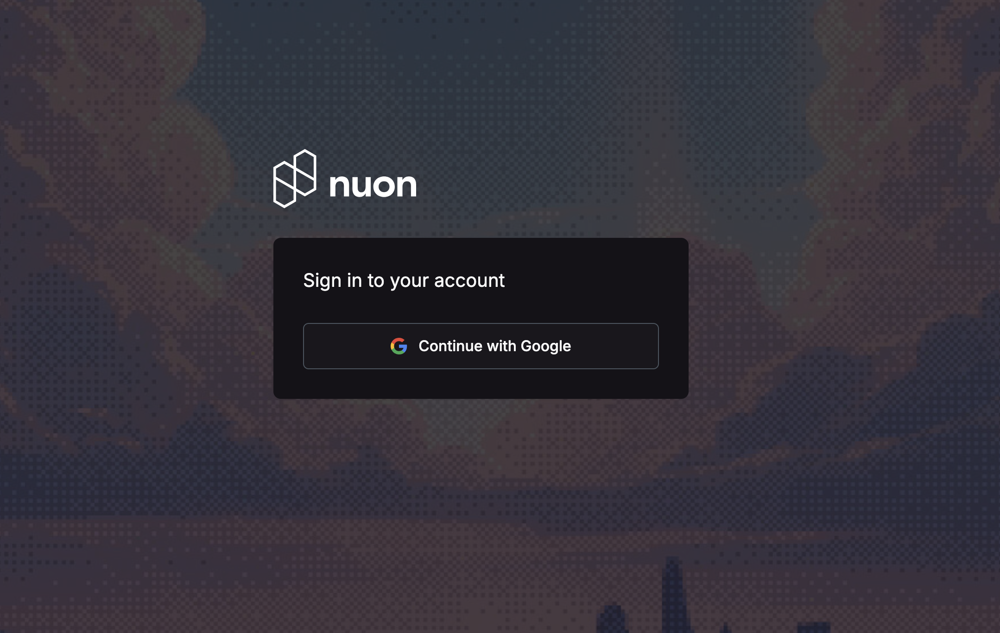

_Feb 3, 2026_

v0.19.770

## Better Support for Custom Nested VPC Templates

We've improved handling of nested VPC stack parameters to better support custom templates for `byo-vpc` (bring your own
VPC) and `byo-eks` (bring your own EKS Cluster) deployments. Parameters from nested VPC stack templates are now
dynamically loaded and "hoisted" into the parent stack in the "VPC Configuration" parameter group.

### Stack Config Breaking Change

<Warning>Breaking Change</Warning>

Apps using the nuon `vpc/eks/default` nested VPC stack should upgrade to `v0.1.12`. This change is a noop on
CloudFormation but addresses an issue with earlier versions that affected strict YAML parsers.

## Nuon Auth Service

BYOC installs now have the option of using the new Nuon Auth service which adds support for `google` and generic `oidc`
providers. Users can bring their own IdP and BYOC Nuon no longer has a dependency on Auth0.

Key features:

- Suport for multiple IdPs
- Device code login flow for CLI authentication
- Configurable allowed domains

## Runner IAM Authentication

Runners can now authenticate using an AWS IAM-based scheme with pre-signed requests. This improves security, simplifies
install provisioning, and reduces friction during runner token refresh.

## Onboarding UX Improvements

Moved new user onboarding to it's own page, to make entering and leaving the flow more intuitive.

## Install Form Improvements

Install form values are now saved as drafts preventing the need to re-input a large set of inputs if the install modal
is closed.

## Customer and Vendor Inputs

App authors can now define inputs as customer or vendor inputs. This is used to control which inputs a customer has
control over in the upcoming customer dashboard.

## Forget Install Component

New feature to "forget" an install component, removing it from an app. Intended to be used for components that have
already been torn down.

## Drift Detection UI

Updated drift detection elements for better visibility into infrastructure state changes.

## Dashboard UX Improvements

- New sign up page design
- Stratus design system updates across app inputs, team page, install forms
- Improved VCS connection experience
- Better action run outputs display
- SSE log connection improvements
- Auto-approved status display for workflow steps
- Improved async boundary patterns for better loading states

## Kustomize Support

Kubernetes manifest components now support Kustomize for more flexible manifest management.

## Bug Fixes

- Fixed empty string handling in edit inputs form
- Fixed platform passing on create install form
- Fixed handling of Temporal workflow not found during cancel
- Fixed short circuit for action crons if install not provisioned
- Fixed app config sync not migrating existing install inputs
- Fixed VCS validation handling
- Fixed multi-tab login invalid state issue
