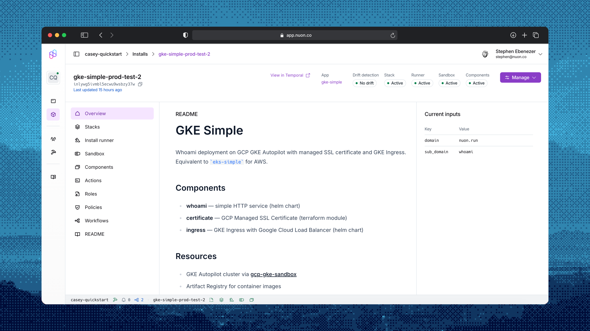

_Mar 25, 2026_

<div className="badge badge--primary">Since v0.19.821</div>

## Workflow TUI

The install workflows TUI is now generally available in the `nuon` CLI. The workflow TUI provides a single place to
follow workflow progress in real time, inspect step details, and take action all from the terminal.


Run `nuon installs workflows` to open a guided, interactive view of your install workflows. From there, you can review
plan diffs, approve steps, retry failed actions, and cancel workflows when needed. The experience is designed to make
day-to-day operations faster and easier for teams that work directly in CLI-first environments.

## Introducing CLI Extensions

We are introducing a way to extend the functionality of the Nuon CLI via custom extensions. Extensions are generally
available and work as first-class `nuon` commands. This enables teams to build tailored workflows directly into the CLI
usage.

We've authored a few extensions which are available now. For example, with `nuon api`, you can browse and call Nuon's
public API from the command line using a spec-driven client that supports interactive discovery and script-friendly
output.

Run `nuon extensions` to explore extensions.

```
nuon extensions browse
  NAME        VERSION     INSTALLED   REPO                    DESCRIPTION
 ──────────────────────────────────────────────────────────────────────────────────────────────────────
  api         v0.19.821   *           nuonco/nuon-ext-api     Nuon Extension: API Client
  render      v0.1.5      *           nuonco/nuon-ext-render  Nuon Extension: Utility to render app c…
```

Try out the `api` extension.

```
nuon extensions install nuonco/nuon-ext-api

nuon api --help
```

### Learn More

- [Nuon CLI Extensions](/guides/cli-extensions)

## Dashboard UI Changes and Improvements

The Nuon dashboard has focused on two themes: moving key product surfaces onto the SPA/BFF architecture and making
install operations more observable and easier to act on.

### Platform and Navigation

- Migrated major product surfaces to the SPA pattern, including onboarding, install components, admin panel, audit logs,
  and install config download flows.
- Improved navigation behavior with empty-route redirects, safer login redirects, and org-level dashboard redirects when
  enabled.
- Simplified and modernized dashboard presentation with better page titling, icon usage, scroll ergonomics, and version
  rendering consistency.

<video
  controls
  autoPlay
  muted
  loop
  playsInline
  style={{ width: "100%", borderRadius: "0.75rem" }}
  src="/videos/Changelog.mp4"
/>

<p style={{ textAlign: "center", fontSize: "1rem", opacity: 0.6, marginTop: "0.5rem" }}>Workflow notifications and Status bar in action.</p>

### Workflow Visibility and Approvals

- Added org-level and install-level active workflow experiences, with follow-up refinements to keep only in-progress
  workflows in active views.
- Added pending-approval toasts and notification improvements so approval-required workflows are easier to spot and
  action.
- Expanded workflow detail panels to include logs and added downloadable logs for easier incident and support handling.
- Improved approvals UX with better defaults and guardrails (including duplicate build warning and safer stack-run
  handling).

### Install and Action Operations

- Added role-aware UI paths for reprovision and install input updates, including custom role selection improvements.
- Added role provision status indicators for install and app role visibility.
- Added quick-action improvements like forget install, ad-hoc action reruns, and better quick-menu loading behavior.
- Improved runner and runner-job interactions, including endpoint alignment for restart behavior.
- Added the ability to download logs to a `.txt` file.

## Role and Operation Roles

### Operation Role Selection and Workflow Propagation

- Refactored role resolution so role mapping and auth context are determined in plan workflows, improving consistency
  between planning and execution.
- Added explicit role override support to reprovision and install-input update workflows via role fields in workflow
  creation paths.
- Continued hardening selector behavior around template rendering, stack-output role lookup, and default-role fallback
  behavior.

### Available Roles and Role Status APIs

- Role picker now allows selecting from all available enabled roles.
- Enable UI visibility into enabled/provisioned roles along with its identifier.

### GCP, Break-Glass, and Custom Role Support



- GCP installs now resolve custom roles and break-glass service accounts through the same operation-role selection used
  by AWS and Azure.
- GCP stack outputs are parsed into the role lookup flow so role pickers and plan workflows see GCP roles alongside
  other cloud roles.
- Sandbox-mode fake stack outputs include custom role, break-glass, and install-input identifiers for role-aware sandbox
  planning.

### Install Stack Role Provisioning Behavior

- Updated CloudFormation role parameter defaults so custom roles are auto-selected when referenced by operation role
  configs (entity-level roles or matrix rules).

## Changed

- Improved `auth login` to better respect configured API URL.
- `installs create` now has support for install selection
- New `runner` group with `restart` and `shutdown` commands.
- Standardized `get`/`current` behavior. `current` is deprecated but will remain supported for some time.
- Fully deprecated `nuon apps sync` command.
- Dashboard UI now routes key surfaces through the SPA architecture, including onboarding, install components, admin
  panel, audit logs, and install config download.
- Workflow UX in dashboard now emphasizes active in-progress runs, surfaces pending approvals earlier, and improves
  plan/step visibility with better defaults and safeguards.
- Operation-role selection in ctl-api was hardened so planning and execution use the same role-resolution flow with
  stronger runtime override handling.
- Install role APIs in ctl-api were expanded and normalized so role availability/provisioning state is exposed
  consistently across clouds.
- Custom role enablement in install stack generation now defaults correctly when roles are referenced, with follow-up
  nil-safety fixes.
- GCP permission fields (GCPPermissions, GCPPredefinedRole, CloudPlatform) are now synced when converting IAM roles.
- Role configs now enforce platform validation to prevent misconfigured cloud-specific fields.
- Deploy flow step sequencing was refined, including noop output handling and retry-after-timeout scenarios.

## Added

- Added interactive app selection to `nuon installs create`. When `--app-id` is omitted, a new app selector contextual
  TUI Is surfaced.
- Added install runner management commands under `nuon installs runner` (`get`, `restart`, `shutdown-vm`).
- Added install workflow diff support in the workflow TUI.
- Added preview `nuon installs reprovision-sandbox` command to schedule sandbox reprovision workflows.
- Added dashboard support for org-level and install-level active workflow views, pending-approval notifications, and
  workflow log downloads.
- Added dashboard role-aware actions for reprovision and install input updates, plus role provision status visibility in
  install/app role workflows.
- Added ctl-api role override inputs for reprovision and install input update workflows so selected roles propagate into
  workflow creation.
- Added ctl-api support for GCP custom and break-glass role resolution in available-role and operation-role selection
  paths.
- Added richer sandbox fake stack outputs (custom roles, break-glass roles, and install inputs) to support role-aware
  sandbox-mode planning.
- Added new param to action config to allow toggle injection of kube config in action context.
- Added auto-retry toggle to the workflow TUI for retrying failed steps without leaving the TUI.
- Added break-glass directory support in the CLI.
