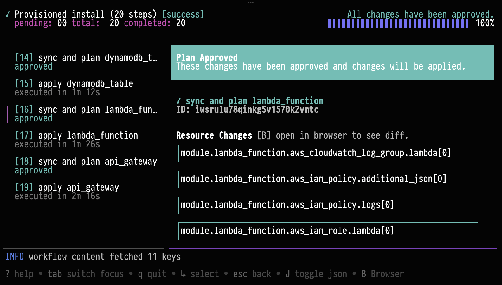

_Mar 21, 2026_

## Workflow TUI

The install workflows TUI is now generally available in the `nuon` CLI. The workflow TUI provides a single place to
follow workflow progress in real time, inspect step details, and take action all from the terminal.



Run `nuon installs workflows` to open a guided, interactive view of your install workflows. From there, you can review
plan diffs, approve steps, retry failed actions, and cancel workflows when needed. The experience is designed to make
day-to-day operations faster and easier for teams that work directly in CLI-first environments.

## Introducing CLI Extensions

We are introducing a way to extend the functionality of the Nuon CLI via custom extensions. Extensions are generally
available and work as first-class `nuon` commands. This enables teams to build tailored workflows directly into the CLI
usage.

We've authored a few extensions which are available now. For example, with `nuon api`, you can browse and call Nuon's
public API from the command line using a spec-driven client that supports interactive discovery and script-friendly
output.

Run `nuon extensions` to explore extensions.

```
nuon extensions browse
  NAME        VERSION     INSTALLED   REPO                    DESCRIPTION
 ──────────────────────────────────────────────────────────────────────────────────────────────────────
  api         v0.19.821   *           nuonco/nuon-ext-api     Nuon Extension: API Client
  render      v0.1.5      *           nuonco/nuon-ext-render  Nuon Extension: Utility to render app c…
```

Try out the `api` extension.

```
nuon extensions install nuonco/nuon-ext-api

nuon api --help
```

### Learn More

- [Nuon CLI Extensions](/guides/cli-extensions)

## Changed

- Improved `auth login` to better respect configured API URL.
- `installs create` now has support for install selection
- New `runner` group with `restart` and `shutdown` commands.
- Standardized `get`/`current` behavior. `current` is deprecated but will remain supported for some time.
- Fully deprecated `nuon apps sync` command.

## Added

- Added interactive app selection to `nuon installs create`. When `--app-id` is omitted, a new app selector contextual
  TUI Is surfaced.
- Added install runner management commands under `nuon installs runner` (`get`, `restart`, `shutdown-vm`).
- Added install workflow diff support in the workflow TUI.
- Added preview `nuon installs reprovision-sandbox` command to schedule sandbox reprovision workflows.
