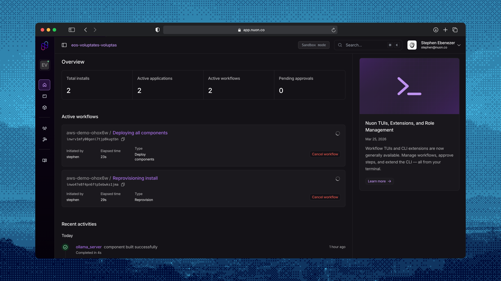
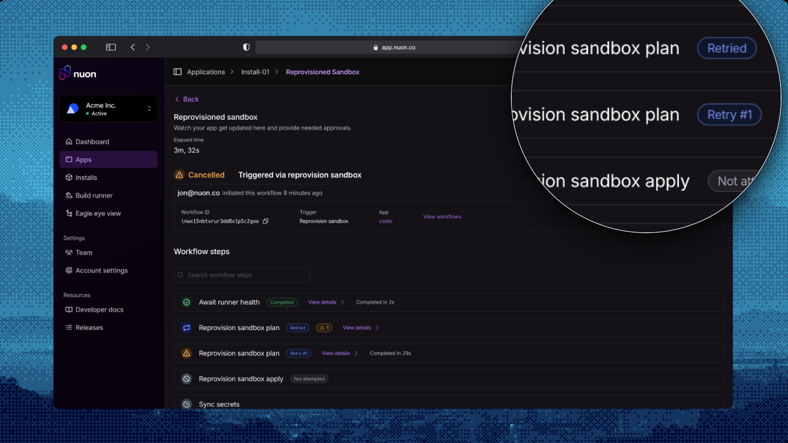
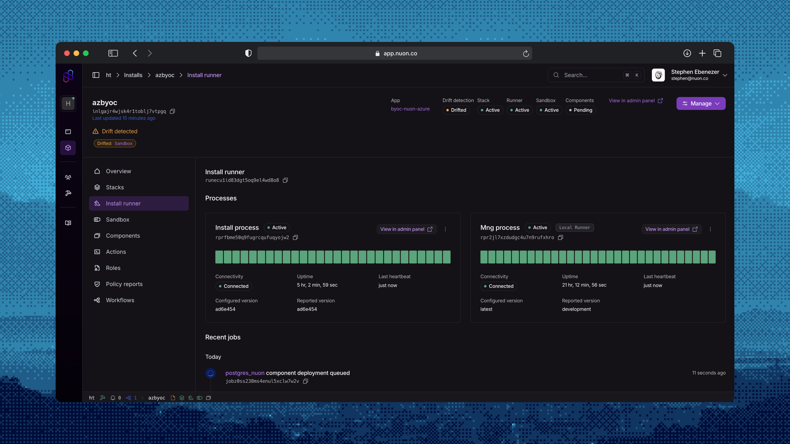
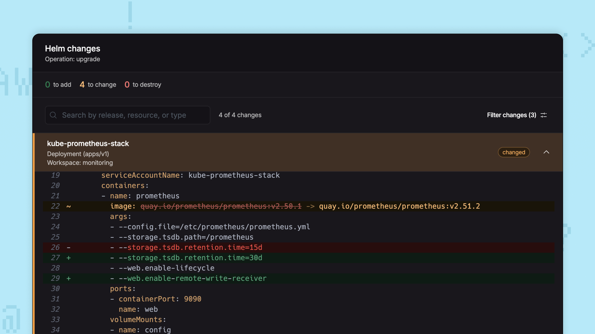
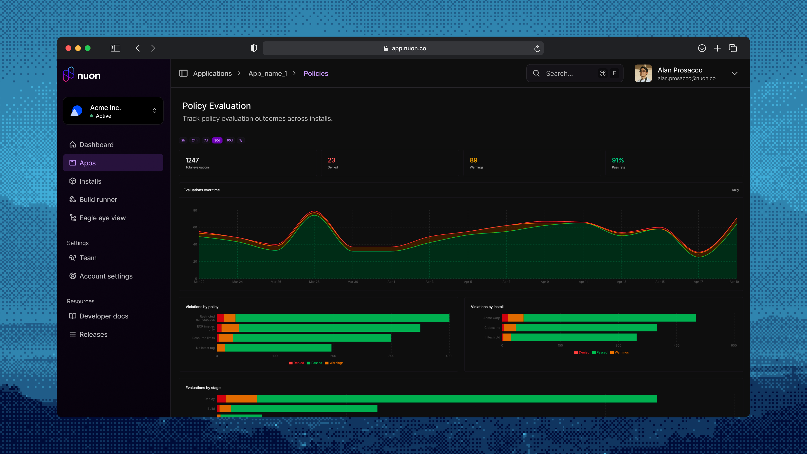
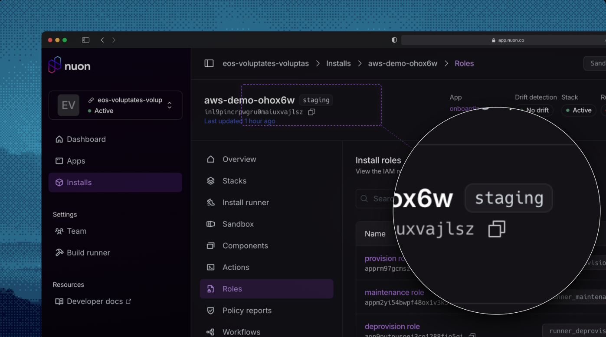

_April 24, 2026_

## Parallel Worflows

No longer blocked on an in-flight deploy - you can run multiple workflows concurrently.



[Workflows](/concepts/workflows) on an install used to queue behind each other, now you can fire off diagnostic actions *while* a deploy is in flight.

## Automatic Retries

Configure `auto_retry` on a [component](/concepts/components) and it re-plans + re-applies itself on transient failures; bound retries per component with `max_auto_retries` so a genuinely broken component still surfaces instead of looping forever.



## Runner Process Management

On the Install's [Runner](/concepts/runners), we now show both the management (VM) process and container process directly and let you control them.



## Drift Detection - Better diffs

Diff rendering is updated to be easier to navigate and approve changes. Preventing a missed critical change in the customer environment.



## Policy Evaluation Analytics

When a policy is starting to throw warnings, you need to know which install and which component, action or deploy triggered it. Every [policy evaluation](/concepts/policies) is now surfaced on a per-app Analytics page.



## Labels

You can now label installs, components, and actions. This enables you to add additional metadata to labels and correlate installs, actions and more together.



## Azure Improvements

### Bring your own stack

Vendors and customers can layer their own infrastructure on top of the default Azure install using the new [install-stacks](https://github.com/nuonco/install-stacks) repo. This makes it easy to meet enterprise networking, compliance, or naming requirements.

### Pick the right sandbox for the job

- [AKS sandbox](https://github.com/nuonco/azure-aks-sandbox) now supports Karpenter via the Node Auto Provisioning add-on.
- [Azure Min sandbox](https://github.com/nuonco/azure-min-sandbox) is a lightweight sandbox for foundation Azure infrastructure such as container registry. It can power environments such as Azure Container Apps.

### Start fast with proven app templates

- [aks-simple](https://github.com/nuonco/example-app-configs/tree/main/aks-simple) for Kubernetes apps
- [aca-simple](https://github.com/nuonco/example-app-configs/tree/main/aca-simple) for serverless container apps on Azure Container Apps

### Runner authentication

Runners on Azure authenticate to Nuon using Azure's workload identity. This removes shared secrets and rotation, and matches the zero-trust posture already available on AWS and GCP.

### First-class container registry support

Builds, image syncs, and component deploys work seamlessly with Azure Container Registry, with per-organization identity and access handled automatically.

### Customer-managed secrets via Key Vault

App secrets sync directly into Azure Key Vault, so workloads can consume them through native Azure mechanisms, the same pattern customers already use with AWS Secrets Manager.

## GCP Improvements

### BYOC on GCP

Nuon BYOC is now available on Google Cloud. The control plane runs on GKE using GCP-native primitives — Cloud SQL for state, [Google Artifact Registry](https://cloud.google.com/artifact-registry) for builds, GCS for install stack templates, and [Secret Manager](https://cloud.google.com/security/products/secret-manager) for secrets — all wired together with Workload Identity. Managed remotely by Nuon the same way as the AWS BYOC offering.

### Cross-cloud image sources

- `aws_ecr` external images can now be pulled from GCP-managed runners. The runner exchanges its GCP OIDC token for AWS credentials via STS `AssumeRoleWithWebIdentity`, no shared secrets required.
- New `gcp_gar` external image source mirrors `aws_ecr`. Vendors provide a service account email and workload identity provider; the control plane impersonates the SA via ADC on GCP, or via Workload Identity Federation when running on AWS.

### Simpler install creation

`project_id` and `region` are no longer required up front when creating a GCP install. Customers pick them when they install the stack, and can re-run the stack with a different project or region without recreating the install.

### Runner authentication

Runners on GCP authenticate to Nuon using [management-mode credentials](/guides/runner-management-mode) backed by Workload Identity. This removes shared secrets and matches the zero-trust posture already available on AWS and Azure.

### Default runner template

Spinning up a GCP install is a one-step flow — installs ship with a default runner template, no custom Terraform required.

### First-class container registry support

Builds, image syncs, and component deploys work seamlessly with [Google Artifact Registry](https://cloud.google.com/artifact-registry), with per-organization service accounts and Workload Identity bindings handled automatically.

### Customer-managed secrets via Secret Manager

App secrets sync directly into [GCP Secret Manager](https://cloud.google.com/security/products/secret-manager), so workloads can consume them through native GCP mechanisms — the same pattern customers already use with AWS Secrets Manager and Azure Key Vault.

### Start fast with proven app templates

- [gke-simple](https://github.com/nuonco/example-app-configs/tree/main/gke-simple) for Kubernetes apps on GKE

## Other Updates

**Policy Config API & Reporting**

- Added a [`GET /v1/apps/{app_id}/policies-configs/{config_id}`](https://api.nuon.co/docs/index.html#/apps/GetAppPoliciesConfig) endpoint for retrieving an app's policy configuration, with corresponding dashboard-ui integration. 

- "Policy Evaluations" has been renamed to "Policy Reports" across the UI and
docs. Sandbox policies now correctly scope to the sandbox install only.

**Nuon CLI - New Commands**

`nuon install stacks`

For listing and retrieving [install stacks](/concepts/stacks). This command is useful for scripting workflows and

```bash
nuon installs stacks
# e.g. to get th emost recent aws quick link url
nuon installs stacks latest --json | jq '.quick_link_url'
```

`nuon installs actions`

Has been augmented with sub-commands to get action outputs:

```bash
# for use in CI
nuon installs actions outputs --action-workflow-id --json
```

`nuon installs components`

Has been augmented with sub-commands to get component outputs:

```bash
# for use in CI
nuon installs components outputs --component-id --json
```

